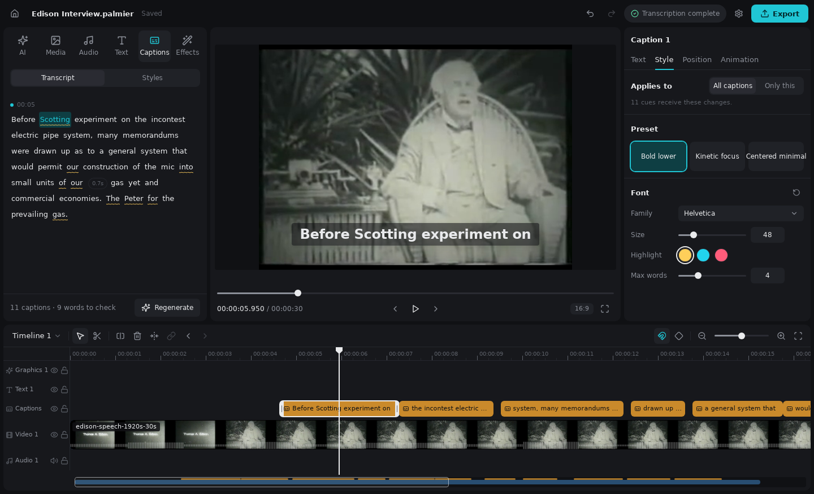
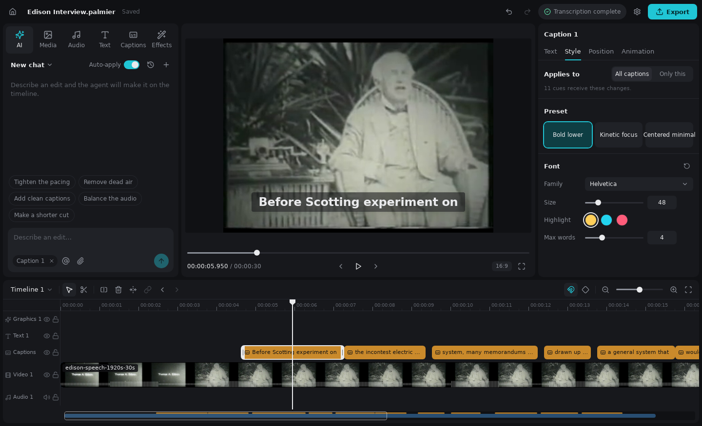
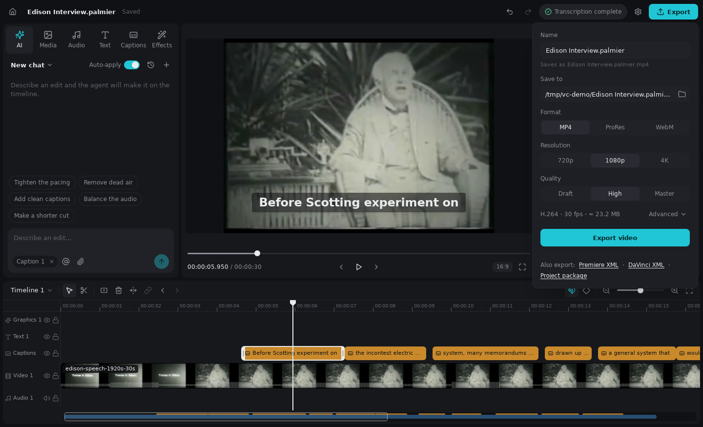

# Video Creater

> **Early preview:** Video Creater is under active development. Features, project formats, and
> setup steps may change, and builds may contain bugs. Keep backups of important projects and
> original media. This repository is not a stable release or a promise of support.

**Edit video by talking to it.** Video Creater is a desktop editor for macOS and Linux that
transcribes your footage on your own machine, lets you cut and caption from the words people
actually said, and pairs a real multi-track timeline with an AI agent that proposes edits you can
inspect and undo. Your media and transcripts stay local, and finished work leaves as MP4, ProRes
or WebM, or as a Premiere or DaVinci timeline.



## At a glance

- **Captions from speech, on device.** Transcription and speech analysis run locally with
  app-managed models. Generate captions in one click, fix words in the transcript, and restyle
  every cue at once.
- **An agent that edits the timeline, not a black box.** Describe a change in plain language.
  Safe edits apply as one batch with **Show changes** and **Undo**; anything paid, generative or
  destructive waits for your review.
- **A real editor underneath.** Multi-track timeline, effects and transitions, text and graphics
  layers, audio cleanup, and frame-accurate preview on a bundled GStreamer Editing Services
  runtime.
- **Delivery without lock-in.** Export MP4, ProRes or WebM at up to 4K, hand off Premiere XML
  or DaVinci XML, or pack the whole project into one folder.
- **Your keys, your machine.** Generative providers are optional and use credentials you store in
  the system keychain. The source is MIT licensed.

## From footage to export

Import a clip, add it to the timeline and open **Captions**. The transcript appears beside the
preview with low-confidence words marked for a quick check, and the cues land on their own track.
The **AI** tab takes it from there: ask it to tighten the pacing, remove dead air or make a
shorter cut.



When the cut is ready, **Export** is the one place to choose a format, resolution and quality, or
to send the timeline to another editor.



The screenshots show the Linux build working on the public-domain Edison sample footage; see
[media provenance](THIRD_PARTY_NOTICES.md).

## Editor

The editor keeps one fixed layout. The left panel holds the **AI · Media · Audio · Text ·
Captions · Effects** tabs, the preview fills the center, **Properties** opens on the right only
while something is selected, and one full-width timeline sits at the bottom. The top bar holds
Home, the project name, Undo and Redo, the **Background tasks** indicator, the gear menu, and
**Export**.

In the AI tab, validated safe edits apply automatically as one batch while **Auto-apply safe
edits** is on. The result card shows facts, **Show changes**, and **Undo** for the whole batch.
Paid or generative work, background jobs, render and export records, project settings, broad or
destructive changes (removing clips, tracks, timelines, or media), and any unclassified action
always stop at a review card, as does every edit when auto-apply is off.

Transcription, analysis, generation, render, export, and agent jobs appear only under Background
tasks. The Export popover under the **Export** button is the single export entry point for video,
Premiere XML, DaVinci XML, and project packages.

Below 1024 px the same editor switches to a phone layout with a bottom tool bar and bottom sheets,
targeted at the iPhone 17 Pro viewport (402×874). This is layout support only; there is no phone
runtime. See [the editor redesign spec](docs/superpowers/specs/2026-09-13-editor-ui-ux-redesign-design.md).

## Settings

Open **Video Creater > Settings** to inspect and manage the app. The category badges report
live state rather than setup placeholders:

- **General** reports the required GStreamer/GES composition runtime, reviewed plugin policy,
  compatibility runtime, AVFoundation final delivery, notifications, and updates.
- **Models** installs, verifies, retries, and removes app-managed transcription and speech
  analysis models. Choose **Install**; do not copy model files into the app folder manually.
- **Agent & MCP** checks Codex app-server, the bundled MCP server, and the structured proposal
  validator independently.
- **Skills** verifies the three required project skills and previews exact files before a
  scoped repair.
- **Storage** inventories app and active-project storage. Cleanup always previews exact paths
  and bytes before confirmation; projects and model data are not generic cleanup targets.
- **Providers** saves separate provider credentials in the macOS login Keychain. The app never
  reads a saved secret back into the Settings UI.

Model downloads are resumable through explicit retry and verification. A transcription-model
download can be cancelled. The production speech-analysis model set is currently intentionally
non-cancellable because its multi-file downloader does not yet have a safe cancellation
ownership boundary; closing or restarting the app records interruption and offers retry.

GStreamer/GES is not optional: it is the primary timeline composition, draft, graphics,
compatibility, and WebM runtime. AVFoundation is the macOS final-delivery exporter for supported
H.264, H.265, and ProRes outputs. Settings reports these responsibilities separately.

See [Settings operational readiness](docs/settings-readiness.md) for storage paths, model
provenance, health and operation contracts, release requirements, verification commands, and
the current evidence boundary. [The product backlog](docs/product-backlog.md) is the canonical
record of product direction, status, priority, and next work. [The Palmier parity
tracker](docs/parity.md) remains the reference-specific audit and detailed evidence history; since
the 2026-09-15 redesign the editor chrome no longer targets Palmier layout parity.

## Development

Install dependencies with `pnpm install`, then run the complete desktop development
runtime with `pnpm dev`. The internal `pnpm dev:web-runtime` command starts only Vite and
still requires a backend transport. For the real authenticated browser editor, build the packaged
loopback host with `pnpm build:remote-host`, install its systemd user service, and expose it only
through Tailscale Serve. [Remote access](docs/development/remote-access.md) documents installation,
pairing, status, recovery, and the verified-URL rule. `pnpm test:remote-host` runs the real Rust
host through desktop and phone browser workflows; fixture-only visual QA remains available through
`pnpm visual:qa:browser`.

The principal Settings verification commands are:

```bash
pnpm e2e:settings
pnpm visual:qa:browser -- --only settings-state
pnpm visual:qa:browser-release
pnpm verify:gstreamer-runtime
```

Browser visual fixtures prove deterministic web UI states; they do not prove native Tauri
dialogs, Finder, Keychain interaction, or a packaged WebView. Consult
[docs/settings-readiness.md](docs/settings-readiness.md) before interpreting the outputs. The
retained packaged-app acceptance report separately proves the signed WebView, restart recovery,
native folder picker, Finder reveal, isolated Keychain round-trip, and real model acquisition.

Runtime modes, verification tiers, Cargo cache limits, and cleanup commands are documented in
[Runtime and verification development](docs/development/runtime-and-verification.md).

## Linux

Ubuntu 24.04 LTS x86_64 runs the same desktop app with Linux codecs, local models, Secret
Service credentials and a `.deb` package. Build prerequisites, architecture differences,
supported formats, packaging (`pnpm release:linux`) and verification are documented in
[Linux desktop](docs/development/linux.md).

## macOS release

Run `pnpm release:macos:preflight` before `pnpm release:macos`. The release command
requires a valid installed Developer ID Application identity plus Apple notarization
credentials. Configure `APPLE_SIGNING_IDENTITY`, `APPLE_TEAM_ID`, `APPLE_ID`, and
`APPLE_PASSWORD`, or store the Apple ID account and app-specific password in the login Keychain
service `video-creater-notary` and omit the corresponding credential variables. A locally
Developer ID-signed package is not a notarized release; acceptance requires successful Apple
notarization, stapling, and Gatekeeper verification.

## License

Video Creater's original code and documentation are available under the [MIT License](LICENSE),
copyright © 2026 Oleh Vdovenko and contributors. Bundled or vendored components and media retain
their own terms; see [third-party notices and media provenance](THIRD_PARTY_NOTICES.md).
