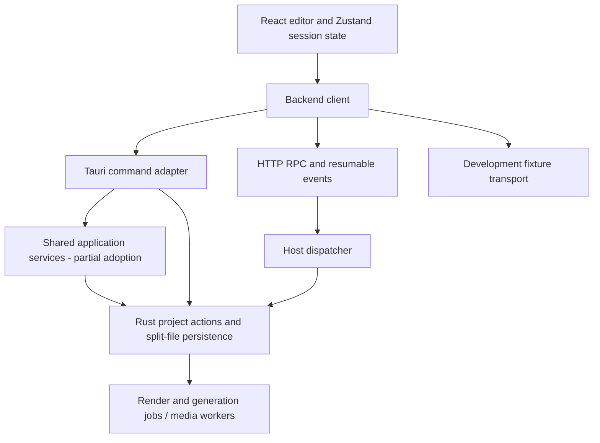

# Architecture and performance action plan

Assessment date: 2026-09-30. Source baseline: `58ed4756a359cfcf486d60c379480e6be21c88e3` (`main`).

This is an assessment and implementation plan, not an implementation or release sign-off.
Two Sol agents explored frontend/backend architecture; a Luna agent explored development
iteration. The primary agent cross-checked the findings, ran the checks below, and chose
the priorities and sequence. The working tree was clean at the start.

## Recommendation

Keep the React/Zustand editor, Rust authority over project state, and isolated media
workers. Improve the existing modular monolith incrementally. The highest-value work is:

1. Close two remote editing consistency gaps before adding optimistic editing or retries.
2. Separate project reads/progress from long-running storage ownership.
3. Make routine development checks and helper preparation cheaper without weakening release gates.
4. Finish a shared application boundary and typed transport contract in small vertical slices.
5. Profile complex editing workloads, then optimize the particular playback, memory, and
   loading costs that exceed agreed budgets.

There is no evidence here that changing UI frameworks, adopting microservices, moving
all project data into a database, or rewriting the renderer would improve the product.

## Current architecture and useful foundations

The adapter separation already exists in `src/lib/runtime/backend-transport.ts:5` and
`bootstrap.ts:74`. Zustand uses selector subscriptions
(`src/editor/store/editor-store-context.tsx:17`); the editor is lazy-loaded
(`src/App.tsx:54`); clips are horizontally windowed and track sorting is memoized
(`src/editor/timeline/track-lane.tsx:66`). These are foundations to preserve.

Rust already has transactional project writes, revision-checked replacement, cross-process
mutation/artifact leases, per-project FIFO commands, sidecar supervision, and separate
job-progress snapshots. Remote hosting already has operation authorization metadata,
idempotency, editor leases, event replay, and a cancellation bypass. The plan addresses
incomplete use of those mechanisms rather than proposing them as new features.

Relevant sources: `src-tauri/src/project/split.rs:1954`, `project/mutation.rs:11`,
`project/command_queue.rs:45`, `project/job_progress.rs:1`,
`web_host/idempotency.rs:80`, `web_host/http.rs:1097`, `web_host/event_hub.rs:38`,
and `src/lib/runtime/adapters/remote-transport.ts:55`.

## Fresh evidence and its limits

Measurements are single local runs unless noted; they are not improvement percentages
or representative latency baselines. Ubuntu VM: 10 logical CPUs, about 11.7 GiB total
RAM; Node 24.18.1, pnpm 10.30.3, Cargo 1.98.1. Available disk was about 90 GiB at
initial inspection. No Rust compilation, cache cleanup, provider calls, or native
packaging was performed.

| Check | Result | Interpretation |
| --- | --- | --- |
| `rtk pnpm build` | Passed; measured subprocess was `pnpm build`, 13.01 s wall time; Vite 4.02 s, 2,081 modules | Current frontend build works. Existing dependencies/caches; not a cold build or HMR measurement. |
| `rtk pnpm lint` | Passed; measured subprocess was `pnpm lint`, 11.63 s | Both TypeScript configurations checked. Build and lint both run the frontend TypeScript checker. |
| `rtk pnpm exec vitest run src/lib/runtime/adapters/remote-transport.test.ts src/lib/runtime/backend-client.test.ts src/lib/timeline-preview.test.ts` | 87 tests passed, 3 files; 1.34 s wall time | Focused correctness evidence only. |
| `rtk pnpm exec playwright test e2e/editor-timeline.spec.ts` | 5 passed; 15.56 s wall time | Desktop and phone viewport fixture flows. First attempt could not open sandbox sockets; authorized rerun passed. No physical phone or native-app claim. |
| Injected remote commit/ticket failure | Reproduced client rejection after successful RPC | Real transport code with a synthetic fetcher, not a live-host failure. |
| Preview calculation microbenchmark | 200 measured samples after 20 warmups per size; results below | Node-only frame calculation, no React, decoding, browser paint, native rendering, effects, or nested timelines. |

The editor chunk is **701.66 kB minified / 206.61 kB gzip**, with a Vite chunk warning.
This is a loading hypothesis, not proof of a slow editor. Build logs and runnable
micro-reproductions are retained locally under `output/architecture-audit-2026-09-30/`:
`frontend-build.log`, `frontend-lint.log`, `targeted-tests.log`, `timeline-browser.log`,
`remote-commit-repro.mjs`, `remote-commit-repro.json`, `preview-scale.mjs`, and
`preview-scale.json`. `output/` is ignored; the scripts/results are not portable committed
benchmark infrastructure. This document retains the conclusions and reproduction recipe.

| Sequential clips, one track/source | Preview calculation p50 | p95 |
| --- | --- | --- |
| 100 | 0.037 ms | 0.082 ms |
| 1,000 | 0.101 ms | 0.237 ms |
| 5,000 | 0.467 ms | 0.911 ms |

Each fixture used adjacent two-second video clips, one 1080p/30 fps media entry, no
transitions, and one active layer. Each run checked that exactly one layer was returned
on all 220 calls. This simple case does **not** support prioritizing a playback rewrite.

Historical VC-027 packaged-app timings in `docs/product-backlog.md:133` explain prior
decisions but were not re-measured here. Existing output files and prior green-suite
reports were not accepted as current verification. Native Linux, macOS/WebKit, signing,
packaged performance, cross-device latency, full release gates, and external CI/branch
protection remain unverified by this assessment.

## Findings, ranked by consequence

### A1 — A committed remote edit can appear to fail (P1, reproduced)

`src/lib/runtime/adapters/remote-transport.ts:109` advances the cached revision after
RPC success, then awaits media ticket creation before returning. The ticket helper
throws on failure (`remote-resource-cache.ts:23`). The editor only installs the returned
project after the complete promise resolves; its error path retains the old project and
marks saving failed (`src/editor/store/project-slice.ts:164`).

Reproduction: inject a fetcher into `RemoteTransport`; return an editor lease; return
`ok: true` from the action RPC with a project at revision 2 containing a media
`relativePath`; return HTTP 503 from `/api/v1/resource-tickets/media`. The action request
rejects despite the successful RPC. The local reproducer confirmed this exact sequence.
State retention follows from the inspected project-slice error branch; a combined
store/transport regression test is still needed.

**Fix:** represent committed project state independently from media readiness. Install
the canonical result and history once; retry ticket acquisition separately and render a
recoverable media-loading/error state. Do not merely swallow ticket errors: synchronous
`remoteResourceUrl()` currently throws for a missing URL. Cover mutation, undo, project
open, reconciliation, and the next edit. Never blindly resubmit a committed action.

### A2 — Remote action revision validation is separate from the write (P1, source-confirmed race window)

`src-tauri/src/web_host/dispatcher.rs:298` reads a project and checks its revision,
then `:325` invokes unconditional action application. That helper acquires its own
mutation lease and reloads the project (`project/split.rs:3440`). A desktop or background
writer can commit between the initial read and action application. The browser editor
lease in `web_host/http.rs:1123` coordinates remote editor ownership; it does not provide
the filesystem mutation lease used by those other writers.

**Fix:** add/use one revision-checked action transaction: acquire the project mutation
lease, load/recover, compare the expected revision, validate/apply the batch, atomically
persist, then publish the result. `replace_split_project_if_revision` already provides
an atomic comparison boundary and metadata transactions for existing projects; reuse
that behavior or a shared conditional-action primitive rather than duplicating it. Propagate typed
revision-conflict errors instead of matching strings in `web_host/rpc.rs:276`.

**Acceptance:** a barrier-controlled test inserts a competing writer at the old race
point; stale actions must return conflict with no extra revision or mutation. Include
concurrent desktop/background writes and exact replay of an already completed request.
The race was not forced against a live host during this assessment.

### A3 — Long-lived global storage ownership still delays reads (P1, code-confirmed; current latency unmeasured)

`src-tauri/src/settings/storage.rs:24` is a process-wide mutex. Render entrypoints hold
its lease across rendering (`render_pipeline/project_export.rs:872`, `:901`), while
desktop project load takes it (`main.rs:1654`). Thus some reads and unrelated project
operations using this mutex remain coupled to long work. The previous mutation/artifact
split already allows ordinary canonical edits during encoding; retain that improvement.

The intended lightweight progress path also loads the whole project twice: once in
`main.rs:1758`, then through `ProjectService::job_progress` at
`app_service/projects.rs:146`. Each load takes the project mutation lease and scans
sidecars (`project/split.rs:2372`). It does **not** take the global storage lease, so it
normally works during encoding, but it can stall behind long mutation holders and does
unnecessary I/O. The host dispatcher already reads snapshots directly (`dispatcher.rs:126`).

**Fix in stages:** give progress a shared, lightweight authorized reader; separate normal
snapshot reads from recovery/session activation; then replace broad cleanup exclusion
with explicit active-artifact pins or a carefully specified reader/writer ownership model.
Keep crash recovery, cleanup identity/fingerprint checks, cross-process locking and the
artifact-before-mutation lock order. Do not simply delete or shorten locks.

**Acceptance:** held mutation/storage leases do not prevent safe progress reads; an
export in project A does not delay permitted reads in B; cleanup cannot delete active
outputs; crash recovery never mistakes an active render for an interrupted one.

### A4 — Remote round trips and queue liveness need explicit policy (P1/P2)

There is also a server-side long-job gate: `web_host/http.rs:1097` wraps project
mutations other than cancellation in `with_valid_lease`, which holds a per-project mutex
for the callback (`web_host/editor_lease.rs:177`). Render dispatch performs the render
synchronously (`web_host/dispatcher.rs:417`). Lease renewal takes that same gate
(`editor_lease.rs:105`); configured lease duration is 30 seconds (`http.rs:186`). A long
render can therefore block both further mutations and lease renewal. This blocking path
is source-confirmed; expiry/takeover behavior under an actual long render needs a test.

**Job boundary:** commit a validated job/attempt and immutable input snapshot under the
short editor/project gates, return its identity promptly, and run it outside those gates.
Publish progress and reconcile completion by job identity and source revision. Preserve
the rule that a takeover cannot invalidate a writer during its commit. Update desktop,
remote and fixture callers together where request/response shape changes; do not merely
release the gate while leaving an untracked mutation running.

Same-project requests are serialized, including reads (`remote-transport.ts:55`). Most
project operations acquire/refresh an editor lease before RPC (`:78`), then wait for a
recursive result scan and media-ticket request (`:113`, `remote-resource-cache.ts:42`).
Those fetches have no explicit deadline/AbortSignal. A permanently unresolved request
can keep later same-project requests waiting. Cancellation already bypasses this queue.

**Fix:** instrument queue wait, lease, RPC and ticket phases separately. Add operation
classes for short reads, writes, job starts and cancellation; deadlines must respect
long-running operations. On mutation timeout, expose an unknown outcome and reconcile
or replay the same request ID/payload within the host's idempotency guarantee. Abort of
HTTP is not proof that the server did not commit. Preserve stable conflict/busy/rate-limit
codes and retry hints, currently reduced to an Error message (`remote-transport.ts:102`).

After correctness is fixed, reuse unexpired leases with safe renewal/takeover handling,
cache tickets by session/project/resource identity with expiry/invalidation, and fetch
only missing resources. Consider bounded concurrent reads only after revision ordering
and recovery side effects are explicit. Measure first; do not remove the mutation queue.
The desktop FIFO also has an unbounded pending `VecDeque`
(`src-tauri/src/project/command_queue.rs:85`). Record queue depth/wait time and introduce
admission limits or coalescing only for explicitly replaceable work. Never drop accepted
canonical edits or run an abandoned write silently after reporting cancellation.

### A5 — The development loop repeats avoidable work (P2, source-confirmed)

The full frontend gate runs `lint` and then a build that repeats the frontend TypeScript
check (`package.json`, scripts `lint`, `build`, `verify:frontend`). Keep standalone builds
checked; compose the full gate from one type check and one bundle-only command.

Desktop startup always runs serial helper preparation (`scripts/tauri-dev.mjs:25`;
eight Linux steps, nine macOS steps in `package.json`). Native fast verification still
checks the whole workspace and disables incremental compilation
(`scripts/run-native-verification.mjs:52`, `:79`). Normal Cargo development already has
an incremental target; add a documented focused development lane using it, while keeping
the bounded release verification lane intact.

The 20 GiB free-space requirement, 24 GiB verification-cache cap, and exact-path cleanup
validation are protections to retain. Measure helper stages before adding fingerprint
skips; Cargo already handles part of invalidation. A correct fingerprint must include
source, lockfiles, toolchain/target, flags, runtime manifests and copy/packaging inputs.

See the delegated [iteration audit](../research/2026-09-30-iteration-audit.md) for
supporting evidence, verification tiers, and timing-history recommendations. No checked-in
GitHub/Forgejo workflows were found; external CI status is unknown, not presumed absent.

### A6 — Large modules and incomplete contracts increase change cost (P2)

Current line counts including tests: `main.rs` 14,844; `codex/tools.rs` 21,078;
`workflows/mod.rs` 16,756; `project/split.rs` 10,346; frontend `lib/project.ts` 4,302.
Counts locate review pressure; they are not compile-time measurements.

`app_service/mod.rs:16` defines coordinator traits exposing only `name()`, while
services and adapters still call concrete persistence functions. The frontend transport
accepts an arbitrary operation string, arbitrary input, and caller-chosen result type
(`src/lib/runtime/backend-transport.ts:1`). Rust's operation inventory classifies
authorization/mutation/revision requirements but does not type frontend payloads/results.

**Fix:** finish the service boundary around project actions/progress first. Either give
a dependency seam behavior that callers actually use, or remove the empty abstraction.
Define owned request/response/event DTOs and generate or deterministically check the
TypeScript operation map from Rust-owned contracts. Preserve separate explicit
authorization policy; generated types are not runtime validation.

Split modules by responsibility before splitting crates. Candidate small crates are
project model/actions and wire contracts, with no Tauri/GStreamer/Temporal dependency.
Only extract them after dependency and Cargo timing evidence shows a useful boundary.
The root default feature set currently includes desktop, media, GPU and Temporal;
`host:dev` adds `web-host` without disabling defaults. Define supported profiles explicitly
instead of assuming `--no-default-features` alone produces a genuinely minimal host.

### A7 — Frontend scale opportunities require richer profiling (P2/P3)

| Area | Evidence and existing mitigation | Next decision |
| --- | --- | --- |
| Playback | `src/editor/preview/timeline-preview.tsx:62` builds a frame on render, plus a prepared frame at `:68`; `src/lib/timeline-preview.ts:170` rebuilds maps/expansion/transition planning. Selector subscriptions already exist. | Profile transitions, nested timelines, captions and prepared media. Cache structural plans by relevant revision/input identity only if measured; evaluate active intervals per playhead. |
| Timeline | `src/editor/timeline/track-lane.tsx:66` memoizes sorting; `:76` filters for the viewport; `:193` renders all transition badges. Clips already use viewport windowing. | Measure dense-transition scrolling; window badges and improve range lookup if it dominates. Do not claim sorting repeats on every scroll. |
| Undo | `src/editor/store/project-slice.ts:11`, `:117`, `:207` retain up to 100 full project clones. | Measure retained bytes on transcript-heavy projects. Start with an explicit byte budget/structural sharing; preserve canonical Rust restore, revision conflict handling and agent markers. Delta history is a later option. |
| Filmstrips | `src/editor/timeline/clip-filmstrip.tsx:22` holds successful promises in a module Map without an eviction limit; key at `:75` omits request width from `:74`. | Test repeated projects/zoom and width changes within one bucket. Add bounded lifecycle-aware eviction and validate key completeness against actual sampling inputs. |
| Editor loading | `src/editor/panels/editor-tab-panel.tsx:2` imports all tabs; root already lazy-loads. | Attribute bundle weight, measure cold editor open and first-tab latency, then lazy-load heavy secondary panels with intentional prefetch/loading states. |

## Target architecture

Use thin desktop/HTTP/fixture adapters calling one application service contract. Services
own authorization context, request identity, revision preconditions, job lifecycle and
domain transactions; infrastructure owns persistence, credential access and media workers.
The domain model/actions must not depend on desktop or HTTP runtime details.

Rust remains canonical. React owns interaction state and derived view models. Keep
playhead updates independent from structural project derivation where profiling supports
it. Jobs consume immutable project inputs/revisions, run expensive work outside short
metadata transactions, and publish validated artifacts/results through explicit ownership.
Events carry revision/request identity; reconnect can replay or fetch a canonical snapshot.
Retain EDL-first generation and Rust validation of structured agent proposals.

## Implementation sequence and acceptance gates

Estimates are engineering effort for one experienced maintainer, including focused tests
and review, not calendar promises. Start with steps 0–3; re-estimate later steps using their
results. Each step should be independently reviewable and revertible.

| Step / suggested Conventional Commit | Scope and dependency | Acceptance gate | Estimate |
| --- | --- | --- | --- |
| 0 — `chore(perf): record reproducible iteration and editor baselines` | Promote audit probes into maintained opt-in tooling; retain timestamped bounded metrics plus latest. Record SHA, versions, machine, features, cache state, fixture dimensions and phase spans. No dependency. | Repeated baselines distinguish warm/cold and UI/transport/native time; reports survive another run; sensitive inputs are excluded. | 2–3 days |
| 1 — `fix(remote): separate committed edits from media readiness` | A1; typed partial media readiness and retry, actual store/transport regression, no automatic duplicate action. May start alongside step 0. | RPC success + ticket 503 yields one committed edit, correct revision/history, recoverable media state; next edit, undo, reconnect and open behave correctly. | 1–3 days |
| 2 — `fix(project): validate revisions inside action transactions` | A2; shared conditional action primitive; typed conflict mapping; route host action dispatch through it. | Deterministic concurrent-writer test; stale write is rejected without mutation; batch atomicity and replay preserved; desktop/remote outcomes agree. | 2–4 days |
| 3 — `perf(dev): shorten focused verification and helper startup` | A5; remove duplicate gate-only TypeScript pass, named focused frontend/native lanes, per-step startup timing. Fingerprint skips only for measured costly stages. Depends on step 0 measurements. | Same full release coverage; requested exact tests cannot silently select zero tests; no-op helper start skips safely; touched inputs rebuild correctly; dev target never auto-cleaned. | 2–4 days; helper invalidation may need 2–4 more |
| 4 — `fix(jobs): read progress without loading full projects` | A3 first slice; shared authorization/path-identity checks with direct progress reader; desktop/host parity. | Prompt progress under held leases, no full project parse, safe handling of missing/replaced project and partial snapshot files; active encode progress still updates. | 2–3 days |
| 4b — `refactor(jobs): release editor gates after durable job admission` | A4 server slice; return job/attempt identity, run long work outside editor gate, reconcile results/events against immutable inputs. Depends on 1–2; coordinate with step 4. | Render longer than 30 s while renewing lease, editing, reading progress and cancelling; safe takeover and host restart; one accepted job yields one result without overwriting newer edits. | 3–6 days |
| 5 — `refactor(storage): separate snapshot reads from artifact cleanup ownership` | A3 larger slice; document resource ownership/lock order first; short transactions and immutable snapshot reads. Depends on step 4; use step 2 primitive. | Export + edit + read + cleanup + crash tests; unrelated project reads proceed; artifacts protected; fresh packaged VC-027 measurement. | 4–8 days |
| 6 — `feat(runtime): preserve typed RPC outcomes and bound request lifetimes` | A4; operation-aware deadlines, unknown-outcome reconciliation, same-ID replay policy, lease/ticket reuse and bounded read concurrency where safe. Depends on 1–2/4b. | Lost response, stalled fetch, expiry, takeover, 409, 429, reconnect and cancellation tests; later work recovers; no duplicate effects; phase-level latency comparison; explicit queue admission behavior. | 3–5 days |
| 7 — `refactor(core): share typed project services across transports` | A6; migrate actions/progress, then jobs one vertical slice at a time; deterministic TS contracts and runtime validation. Depends on 2/4/6 contracts. | Common contract suite runs desktop adapter, host adapter and fixture; malformed payloads fail; errors/events/revisions agree; no canonical writes from agent/JS layers. | 5–10 days in several PRs |
| 8 — `perf(editor): bound retained state and optimize measured hot paths` | A7; byte/cache budgets first where measured, then playback plans, transition windowing or lazy panels according to profiles. Depends on 0 and applicable consistency fixes. | Large-project heap stabilizes; edit/undo/selection/preview parity; browser frame and interaction budgets; no hidden-tab or keyboard/phone regressions. | 3–7 days; omit unneeded optimizations |
| 9 — `refactor(build): isolate domain contracts from native runtimes` | Extract proven pure crate boundaries; explicitly compose desktop/host/MCP/worker feature profiles. Depends on step 7 and Cargo timing/dependency evidence. | Pure model/action tests run without native runtimes; intended feature matrices build; measured incremental cycle improves; release/license/packaging checks unchanged. | 5–10 days; conditional on evidence |
| 10 — `ci: map required checks to supported runners` | Inspect external CI/merge requirements first; record portable, browser, Linux-native and Mac-native lanes. External configuration changes need authorization. | Every required gate has an owner/runner; unavailable platform checks are reported unverified; third-party actions use immutable SHAs. | 1–3 days plus runner availability |

Steps 1 and 2 are separate correctness fixes, not prerequisites for collecting baselines.
Step 3 can proceed independently of the storage redesign. Step 10 discovery can happen
early; actual external CI changes are outside this audit. Do not combine storage redesign,
crate extraction and optimistic editing into one change.

## Measurement matrix and provisional targets

Maintain deterministic small (100 clips), medium (1,000) and stress (5,000) projects.
Include plain sequential video, dense transitions, nested timelines, transcript/caption-heavy
projects, many media assets, and prepared effects. Record actual dimensions, not just labels.
Measure browser fixtures and real Linux desktop separately; repeat accepted changes on
packaged macOS/WebKit before claiming Mac performance.

For interactions, collect at least 100 observations per stable scenario with p50/p95 and
long-task traces. For builds/startup use repeated warm runs plus a separately labelled
cold run; never erase the user's development cache merely to manufacture a cold baseline.
Measure native edits during a 150-second export, progress, cancellation, another project's
read, reconnect, and cleanup exclusion. For remote tests include controlled 20/80/150 ms
RTT and failure injection; synthetic latency is not measured Tailscale performance.

These are proposed initial goals to ratify against step 0, not current product guarantees:

- Common focused frontend type/unit feedback under 15 s warm; one UI flow under 20 s.
- Warm no-change desktop helper preparation under 5 s, excluding app launch; selected
  Rust edit/test loop at least 30% faster than the current measured equivalent if targeted.
- Local edit acknowledgement p95 under 100 ms; persisted commit p95 under 500 ms idle
  and under 1 s during export on the reference workload. Distinguish visual feedback from
  durable success; local optimism must remain reversible and revision-aware.
- At 60 Hz, ordinary interaction frame work targets the 16.7 ms frame interval; prepared
  preview retains its existing benchmark thresholds until a justified platform-specific
  revision. Never gate native playback using Node microbenchmark results.
- Progress/cancel control requests should not wait for render completion. No duplicate
  action on retry, no accepted stale revision, no cleanup of pinned artifacts, and no
  unbounded retained cache growth are correctness/resource requirements.

Do not hard-fail CI on timing percentiles until repeated runs characterize VM noise.
Track trends first; then use stable scenarios and explicit tolerated regressions.

## Rollout, review and deferred choices

Preserve file format and wire compatibility while extracting boundaries. Additive DTOs
need defaults/version negotiation; centralize new behavior behind one path rather than
maintaining two permanent service implementations. Ship storage changes with fault
injection and recovery evidence. Rollback must preserve projects created by the prior
step; avoid combining migrations with performance changes.

No full-project database migration, event-sourced persistence, renderer replacement,
global worker rewrite, React framework change, automatic optimistic handling of every
action, or blanket test parallelism is proposed. Test files may be parallelized only after
shared fixture data, output filenames, native environment variables and ports are isolated.
Playwright already offers worker parallelism; the repo deliberately uses one worker in
both configurations, and the safe increase must be measured.

Review each implementation diff for contract parity, revision/undo semantics, bounded
resource ownership, and evidence matching the changed runtime. Run focused checks during
iteration and complete the applicable frontend/native/release lanes before integration.
Keep external publishing, provider spending/uploads, branch protection and runner changes
outside implementation authority unless separately authorized.

## Primary reference checks

Repository code at the baseline SHA is the primary evidence. Official documentation was
checked on 2026-09-30 for the supporting mechanisms below; it does not establish app speedups.

- React documents external-store subscription and snapshot identity rules. This supports
  preserving selector/identity discipline, not replacing Zustand:
  [useSyncExternalStore](https://react.dev/reference/react/useSyncExternalStore).
- Cargo supports package/feature selection and timing reports; workspace members share a
  target directory. Crate extraction requires evidence rather than an assumed speedup:
  [cargo build](https://doc.rust-lang.org/cargo/commands/cargo-build.html),
  [workspaces](https://doc.rust-lang.org/cargo/reference/workspaces.html),
  [build cache](https://doc.rust-lang.org/cargo/reference/build-cache.html).
- Playwright documents worker parallelism and test-data isolation, supporting staged
  concurrency changes only after isolation:
  [parallelism](https://playwright.dev/docs/test-parallel),
  [best practices](https://playwright.dev/docs/best-practices).
