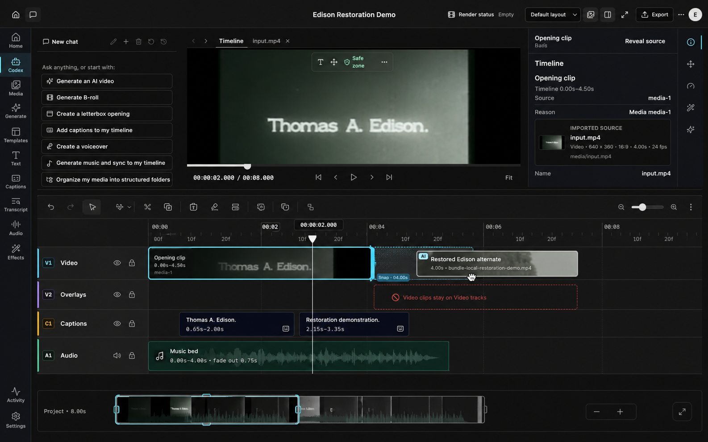

# Timeline UX Redesign Design

## Status

Approved visual direction: Option 2 from the 2026-07-18 timeline visual review.

The mockup is the visual intent, not a pixel-for-pixel mandate. Existing commands, project semantics, and editor chrome remain authoritative unless this specification explicitly changes them.

## Goal

Make the timeline feel precise, responsive, and trustworthy during the edits users perform most often: selecting clips, reading timing, dragging, moving between tracks, trimming, navigating long projects, and recovering from invalid edits.

The redesign must resolve the user-visible failures confirmed in the 2026-07-18 audit:

- dragging an unselected clip leaves selection and the inspector on another clip;
- same-track overlaps can be committed without an explicit transition model;
- resize handles and toolbar controls are difficult to acquire;
- ruler, hover, playhead, and project-duration labels collide;
- invalid destinations are communicated mainly by color;
- clip labels and timing become ambiguous or unreadable;
- track names and lower rows become unreachable at constrained heights;
- ruler and grid rendering scale with total project duration and participate in pointer-driven rerenders.

## Scope

This work covers the desktop timeline surface and the collision validation used by manual and agent timeline edit patches. It includes:

- timeline panel layout, scrolling, toolbar sizing, ruler, tracks, clips, playhead, and overview navigator;
- selection, focus, drag, resize, snapping, collision, cancellation, and invalid-target feedback;
- adaptive clip content and full track identity;
- viewport-bounded rendering for the ruler, grid, and timeline items;
- canonical same-track collision validation for timeline edit patches;
- keyboard and assistive-technology equivalents for changed interactions;
- unit, component, browser, visual, and performance verification.

The existing editor shell, preview, Codex rail, inspector, project format, media pipeline, render pipeline, undo model, and horizontal ruler/canvas synchronization remain in place.

## Non-goals

- No new transition or crossfade object.
- No freeform stacking of overlapping items on one track.
- No new timeline schema solely for presentation state.
- No replacement of the existing export, render, media, or inspector workflows.
- No mobile or touch-first timeline redesign.
- No new full-screen timeline command merely because the mockup contains an expansion glyph.
- No frame-accurate editing expansion beyond the project’s existing timing and snapping contracts.

## Design Principles

### The edit under the pointer is authoritative

Pointer-down on an editable clip selects that clip before starting a move or resize. The inspector, resize handles, contextual actions, keyboard commands, drag preview, and eventual patch all refer to the same selection.

Modifier-assisted multi-selection remains available. Dragging an item already inside a multi-selection moves the valid group. Dragging an item outside the group replaces the selection with that item before the drag starts.

### Preview and commit use one decision

The same pure edit evaluator determines both the visible preview and the committed result. It returns:

- accepted or rejected state;
- resolved target track;
- resolved timeline start and duration;
- snap target and guide position;
- collision or compatibility reason;
- the patch that may be committed.

Pointer-up must not recalculate the edit through a different path. Rust-side validation remains the final authority and mirrors the same collision rule for patches from the UI or an agent.

### Dense does not mean tiny

The timeline stays visually compact, but primary controls do not flex below their intended size. Information density comes from hierarchy and adaptive disclosure, not undersized hit targets or overlapping labels.

### Invalid edits explain themselves at the target

Accepted and rejected track states retain the existing cyan and red accents, but color is never the only signal. The target row shows a short reason such as `Video clips stay on Video tracks`, `Track locked`, or `Overlaps Opening clip`. The same message is announced through a polite live region.

## Layout

### Timeline panel

The toolbar and ruler remain fixed within the timeline panel. Track rows occupy the remaining height in an internally scrollable viewport. The overview navigator remains fixed below the track viewport.

At 1280×720 and 1024×720, every track must be reachable through the timeline’s own vertical scrolling. The editor workspace must not clip the audio row with no recovery path. At taller sizes, the track viewport consumes available space instead of leaving a fixed-height empty band.

The timeline toolbar uses compact shadcn icon buttons with fixed dimensions, `shrink-0`, accessible names, tooltips, and visible focus. No interactive toolbar control may collapse below 28×28 CSS pixels. The primary selection tool and zoom controls use at least 32×32 CSS pixels.

### Track identity column

The left column remains synchronized vertically with the track canvas and exposes both a lane badge and full track name, for example `V1 Video`, `H1 HyperFrames`, `O1 Overlays`, `C1 Captions`, and `A1 Audio`.

The column uses `clamp(152px, 15vw, 220px)` rather than disappearing into lane codes. Common names remain visible at the supported desktop widths. Longer custom names may truncate only when a tooltip and accessible full name are present. Track enable, mute, visibility, and lock controls retain their existing semantics.

### Track rows

Rows use adaptive heights with a 44-pixel minimum. Video and audio rows default to 64 pixels when filmstrips, waveforms, automation, or fades need room. Caption and overlay rows default to 48 pixels. Resizing a row must preserve a transparent hit region large enough to acquire without making the visible divider heavy.

Selected, focused, dragged, disabled, generated, and invalid states have separate visual treatments:

- selected: persistent cyan outline and handles;
- keyboard focus: neutral high-contrast focus ring outside the selected treatment;
- dragged: elevated ghost with reduced-opacity origin;
- accepted target: restrained cyan inset guide;
- rejected target or collision: red dashed boundary plus visible reason;
- disabled or locked: reduced contrast without removing identity.

Motion is limited to short state transitions and is disabled under reduced-motion preferences.

## Ruler and Time Readouts

The ruler derives its visible tick range from scroll position, viewport width, zoom, and a small overscan. It does not create ticks or grid lines for the full project duration.

Tick density adapts to available pixels:

- major labels maintain at least 72 pixels of separation;
- minor ticks follow the existing snap interval when space permits;
- subsecond or frame-oriented detail appears only at zoom levels where it is legible;
- the grid uses the same visible tick model as the ruler.

The project-duration range is not painted over the first ruler labels. The playhead owns one precise time badge. Hover time yields to the playhead when their labels would collide, and both labels clamp inside the visible canvas bounds.

Normal ruler labels use the shortest unambiguous project time format. Precise interaction feedback uses the existing millisecond timecode format, for example `00:00:02.000`.

## Clip Content

Clip bodies prioritize information in this order:

1. clip identity;
2. current timeline start and end, or duration;
3. status or validation;
4. source and provenance details.

Source ranges do not masquerade as current timeline timing. Detailed source timing remains in the inspector or an explicitly labeled secondary surface.

Content adapts to rendered width:

- clips narrower than 48 pixels show an accent and accessible label without forcing text into the body;
- clips from 48 through 119 pixels show a truncated title;
- clips from 120 through 219 pixels add current timeline timing;
- clips at least 220 pixels wide may add a filmstrip, waveform, generated status, fades, or concise provenance.

Filmstrips, waveforms, automation, fades, warnings, and handles remain editor-specific rendering. Decorative badges must not compete with the title. A generated or workflow state stays inspectable through an accessible name and tooltip when it cannot fit visibly.

## Move, Snap, and Collision Behavior

### Selection and drag start

Pressing a clip body selects it synchronously before pointer capture. A small movement threshold distinguishes selection from dragging. A click does not leave a latent drag state.

The active preview follows the pointer at animation-frame cadence. High-frequency pointer coordinates live in refs or an isolated interaction layer; they must not rerender the complete timeline tree for every pointer event.

### Magnetic snapping

Move and resize operations snap through the existing snap system to:

- neighboring clip edges;
- the playhead;
- relevant edit points;
- the existing timeline snap interval.

The guide identifies the resolved seam and precise time. Sticky snapping releases only after the existing pixel-distance threshold is crossed, so the clip does not jitter around a boundary.

### Same-track collision policy

Until an explicit transition model exists, items on one track may not overlap.

- A resize clamps at the nearest neighboring item edge. Continuing past the edge retains the clamped preview and shows the blocked interval and collision reason.
- A move may magnetically align before or after a neighbor when the clip fits. If no valid gap can contain the clip at the proposed destination, the preview is rejected and pointer-up restores the original placement.
- A multi-item move preserves relative offsets. If any unpinned item would collide or become incompatible, the group preview is rejected as a whole.
- Existing invalid legacy overlaps remain visible and inspectable, but an edit may not create or increase an overlap.

The same rule applies to keyboard nudge, keyboard resize, pointer edits, and validated agent patches. Undo continues to restore the prior canonical state.

### Cross-track destinations

A destination must be compatible with the item kind, unlocked, and collision-free. Compatible targets show the proposed placement. Incompatible targets show the target-local reason and leave the original placement unchanged on release.

The target label and canvas row communicate the same state. Pointer cancellation, lost pointer capture, or `Escape` cancels the edit, clears snap and error feedback, and restores the canonical item geometry.

## Resize Behavior

Resize handles remain visually narrow but expose an invisible hit region of at least 16 CSS pixels along the active edge. The handle spans enough row height to acquire reliably and retains a visible keyboard focus state.

During resize:

- the clip body previews its resolved geometry;
- a compact bubble shows the active edge time and resulting duration;
- snap guides and collision boundaries update from the same edit evaluator;
- left-edge resize preserves source/timeline semantics already supported by the project action;
- right-edge resize cannot create a same-track overlap;
- ripple resize continues to use its separate plan and validation contract.

Keyboard resize uses the same resolved geometry and error messages as pointer resize.

## Overview Navigator

The selected visual direction adds a compact overview below the track viewport. It shows the entire project duration and the currently visible time window.

The overview is an editor-specific canvas layer so a long project does not add one DOM node per clip or thumbnail. It may reuse cached filmstrip frames and waveform summaries; when those are unavailable, it uses the existing track-kind colors and item boundaries.

Users can:

- click the overview to center the main viewport;
- drag the viewport frame to pan horizontally;
- drag either viewport edge to change zoom while keeping the opposite edge anchored;
- use the existing minus and plus zoom controls beside the overview.

The overview frame has visible handles. When the frame is focused, `ArrowLeft` and `ArrowRight` pan by 10 percent of the visible duration; the existing minus and plus controls are the keyboard alternative to edge-drag zoom. It does not add a new `Fit` or full-screen command. The overview and main canvas share one view-state source, so panning or zooming either surface updates the other without feedback loops.

## Component Architecture

`TimelineEditor` keeps its public workspace-facing API and becomes the coordinator rather than the renderer for every timeline feature.

The implementation should separate these responsibilities:

- **Timeline viewport model:** scroll, zoom, client dimensions, visible time range, overscan, and coordinate conversion.
- **Timeline edit evaluator:** pure move, resize, snapping, compatibility, collision, and reason calculation used by preview and commit.
- **Interaction controller:** pointer capture, movement threshold, animation-frame scheduling, cancellation, and live announcement.
- **Ruler and grid:** viewport-bounded ticks, edit points, hover, playhead, and label collision avoidance.
- **Track headers and canvas:** synchronized vertical geometry, row states, and visible-item rendering.
- **Timeline item:** adaptive clip content and distinct selection, focus, drag, warning, and handle layers.
- **Overview navigator:** full-duration canvas summary and shared view-state controls.

Static layers and individual timeline items are memoized around stable inputs. A pointer preview updates only the interaction overlay, the dragged item, the target row, and the relevant guides.

## Data Flow

1. Pointer-down resolves the clip, updates authoritative selection, captures a canonical interaction snapshot, and starts pointer capture.
2. Pointer movement is coalesced to the next animation frame.
3. The interaction controller converts pointer coordinates through the viewport model.
4. The edit evaluator resolves snapping, target compatibility, collision, geometry, and reason.
5. The interaction overlay renders the ghost, target row, snap guide, collision interval, resize bubble, and live status.
6. Pointer-up reuses the latest accepted evaluation and emits one timeline patch.
7. Canonical project state rerenders the committed placement. A rejected edit or backend validation error restores the original geometry and keeps the reason visible long enough to understand.

View-state flow is separate: ruler scrolling, canvas scrolling, overview panning, and zoom controls update a single `{ zoomPercent, scrollLeft }` state, which drives all time-coordinate surfaces.

## Error Handling

- Invalid preview states never emit a patch.
- Rust validation errors restore canonical state and appear near the timeline interaction, not only as a global toast.
- Target-local messages use plain corrective language and name the blocking rule or item.
- Locked tracks, incompatible tracks, collisions, missing source bounds, and ripple-plan errors remain distinct reasons.
- Pointer cancellation and component unmount clear animation frames, pointer state, snap guides, target rows, and transient announcements.
- The live region avoids repeating the same message on every pointer frame.

## Accessibility

- All icon-only controls have exact accessible names and tooltips.
- Full track names remain available visibly and programmatically.
- Selection and focus are not represented by color alone or by the same ring.
- Accepted and rejected destinations include text and a live announcement.
- Drag, move, resize, nudge, and overview navigation retain keyboard paths.
- Resize handles expose meaningful edge names and current values.
- Time readouts and transient feedback do not steal focus.
- Reduced motion removes nonessential transitions without removing state feedback.

## Performance Requirements

- Ruler and grid node counts are proportional to the visible viewport, not project duration.
- Timeline items outside the visible time range are omitted with at least one viewport of horizontal overscan; selected or actively edited items remain mounted when required for continuity.
- The overview uses one canvas surface rather than a full duplicate DOM timeline.
- Pointer movement does not update top-level timeline React state more than once per animation frame.
- Filmstrip requests are limited to visible or overscanned video clips and remain bucketed by zoom and row height.
- A deterministic 30-minute fixture at 1440×900 renders no more than 400 combined ruler and grid tick elements.
- A local performance trace of the 30-minute fixture must show no pointer-interaction task longer than 50 ms during a representative move and resize, with visual updates targeting the display frame cadence.

## Responsive Acceptance

### 1440×900

- The approved visual hierarchy is recognizable: fixed toolbar/ruler, readable full track identities, roomy clip rows, and overview navigator.
- Selection, drag ghost, snap seam, invalid destination message, waveform, and current-time badge remain legible.

### 1280×720

- All track types are reachable without the workspace painting over the timeline.
- Toolbar controls retain their hit sizes.
- Time labels do not collide.

### 1024×720

- The timeline remains operable through internal horizontal and vertical scrolling.
- Track names may truncate but retain lane identity, tooltip, and accessible full name.
- No toolbar control shrinks below its minimum target size.
- The audio row and overview remain reachable.

## Verification

Implementation begins with failing tests for each confirmed regression.

### Pure model tests

- move and resize snapping use the same resolved result as commit;
- resize clamps at a neighbor and cannot create overlap;
- move rejects a destination with no fitting gap;
- compatible, locked, incompatible, and colliding targets return distinct reasons;
- multi-item movement preserves offsets and rejects atomically;
- keyboard and pointer inputs resolve through the same collision policy;
- visible tick ranges and overscan remain independent of total duration.

### Component tests

- pointer-down selects an unselected clip before drag starts;
- inspector-facing selection and handles follow the dragged clip;
- selected, focused, and dragged treatments can coexist without conflation;
- resize hit regions meet the minimum size and expose correct accessible names;
- target-local error text and the polite live region update once per reason;
- clip content changes at width thresholds and reports timeline timing;
- toolbar buttons do not flex-shrink;
- vertical scrolling reaches the final track;
- overview interactions update the shared view state.

### Browser and visual QA

- refresh drag, invalid-drop, and resize fixtures against the approved direction;
- add same-track collision and drag-selection ownership fixtures;
- add 1440×900, 1280×720, and 1024×720 populated timeline captures;
- test mouse drag, edge resize, cross-track rejection, `Escape` cancellation, undo, keyboard resize, overview pan, overview zoom, and horizontal-scroll synchronization;
- visually compare the 1440×900 implementation with the approved mockup and inspect spacing, clipping, type scale, borders, target-local feedback, and time-label collisions.

### Performance QA

- add the deterministic 30-minute fixture and assert the ruler/grid element ceiling;
- record a local browser trace for one move and one resize;
- confirm filmstrip requests remain limited to the visible window plus overscan;
- run the narrowest timeline tests, the complete `TimelineEditor` suite, browser visual QA, and `pnpm lint`.

## Delivery Order

The implementation plan should preserve usable checkpoints in this order:

1. shared viewport and edit-evaluation models with red-first tests;
2. authoritative selection, collision policy, target-local feedback, and resize hit areas;
3. viewport-bounded ruler/grid/item rendering and isolated animation-frame interaction previews;
4. adaptive track headers, rows, clip content, and constrained-height scrolling;
5. overview navigator and shared view-state integration;
6. responsive visual polish, accessibility verification, long-project trace, and fixture refresh.

Each checkpoint must keep the existing undo, keyboard, track-state, and workspace integration tests green before the next begins.

## Acceptance Criteria

The redesign is accepted when:

- a user can always tell which clip will be edited;
- a user can acquire move and resize targets without pixel hunting;
- an invalid edit explains why at the place it failed;
- manual or agent patches cannot introduce a new same-track overlap;
- ruler and time labels remain readable at supported widths and zoom levels;
- all tracks remain reachable at constrained heights;
- a long project renders timeline structure proportional to the viewport;
- the implemented 1440×900 state visibly matches the hierarchy and interaction language of approved Option 2;
- the required unit, component, browser, visual, accessibility, and performance checks pass.

## Measured verification evidence (2026-07-19)

Verification was finalized on `e8eeb2dd3d8a684da330a664a9c1c49dcbadc6ae`.

- Fresh full browser QA passed all 78 primary scenarios on that product HEAD, including the final timeline interaction and responsive captures. Fresh `rtk pnpm visual:qa:baseline-policy` found 78 expected screenshots with zero missing, empty, or unexpected baseline files and passed manifest, integrity, and platform checks. The current product verification also passed the full frontend suite at 99 files and 1,997/1,997 tests, `rtk pnpm lint`, and `rtk pnpm build`.
- Original-resolution inspection passed for `output/playwright/browser-visual-qa/modern-editor-timeline-long-project.png` (1440×900), `modern-editor-timeline-1280x720.png`, `modern-editor-timeline-1024x720.png`, `timeline-resize-desktop.png`, `timeline-resize-narrow.png`, and `editor-palmier-desktop.png`. The captures retain full lane identity, reachable audio and overview controls, readable ruler and timing, authoritative selection, valid resize geometry, and the approved Palmier label/row geometry without blank or clipped timeline surfaces.
- The final production-rendering trace used the deterministic 1,800-second fixture at 1440×900 after network idle, 250 ms idle, and two settling frames, with **zero timeline interaction warmups**. Opening began unselected, unfocused, and not dragging; its first delivered move preview was already `selected:true` and `dragging:true`. Browser Event Timing processing maxima were **20.2 ms** for the first move and **5.1 ms** for the first right-edge resize. Both windows contained zero Long Tasks, actual preview delivery peaked at one per animation frame, and the fixture rendered 114 ruler ticks plus 113 gridlines, **227/400** combined, with 11 live timeline item shells. Supported evidence is `output/design-review/timeline-cold-performance/timeline-cold-production-followup-summary.json`, `.playwright-cli/traces/trace-1784450170286.trace`, and `.playwright-cli/traces/trace-1784450170286.network`.
- Development diagnostics remain slower because the Vite entry deliberately preserves React StrictMode and its double invocation; that non-shipping path measured 46.6 ms move and 24.9 ms resize processing and is not the production acceptance gate.
- The exact all-target Rust command, `rtk env VIDEO_CREATER_HEADLESS_RUST_SUITE=1 cargo test --manifest-path src-tauri/Cargo.toml project::action::tests -- --nocapture`, exited 0 with 38 passed and 0 failed. The four custom native harnesses printed explicit deferral to their dedicated native lanes: `media_inspection_appkit`, `precompose_alpha_ges`, `project_export_prores_appkit`, and `project_export_nested_effect_appkit`. The flag prevents headless Cargo orchestration from entering those AppKit/GES harnesses; it does not replace their dedicated native coverage. The prior full clippy result remains current for Rust inputs because the performance remediation changed only TypeScript sources and tests, with no Rust or Cargo changes.
