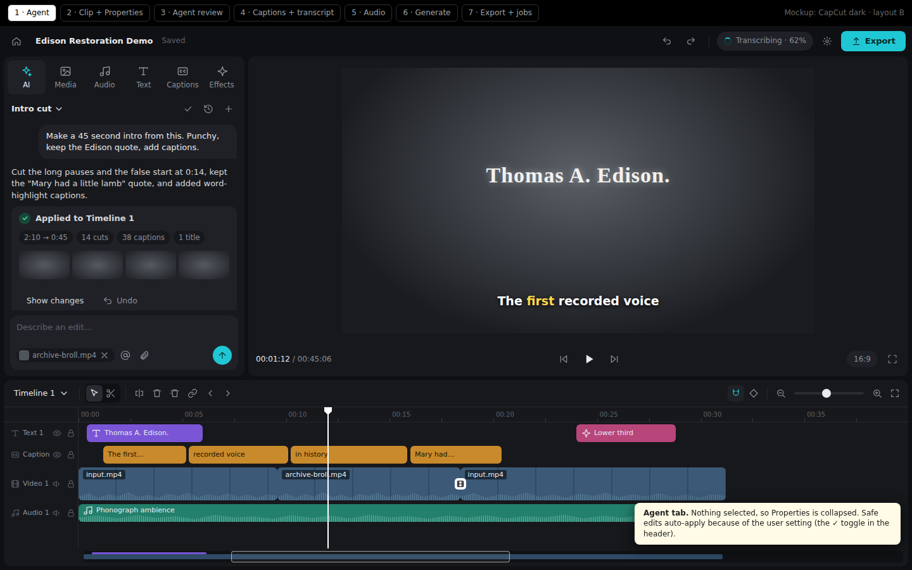
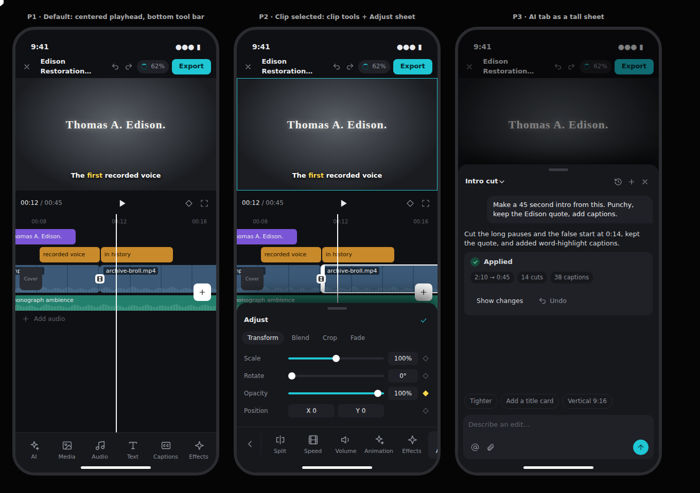
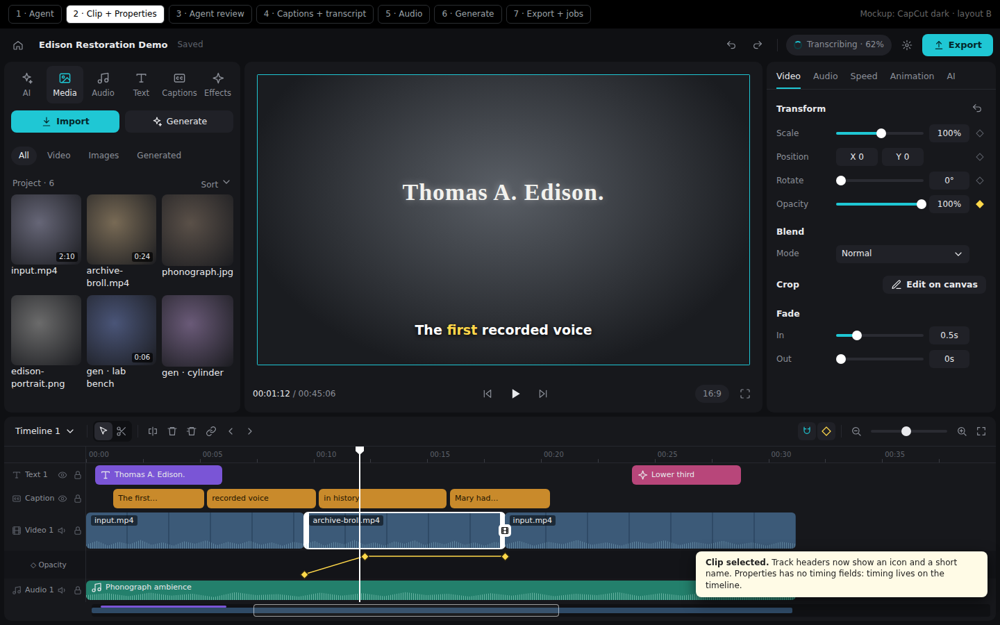
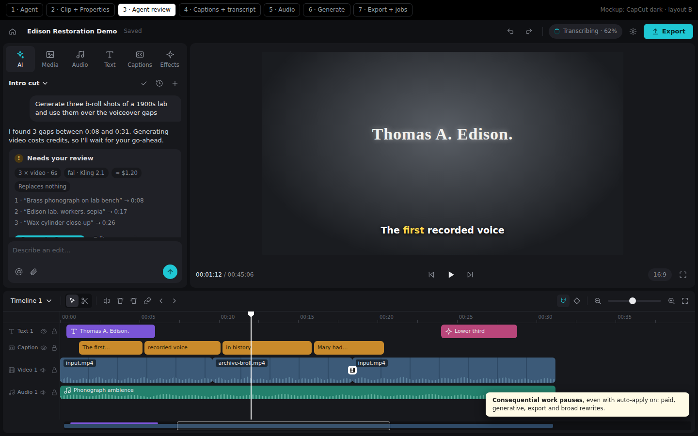
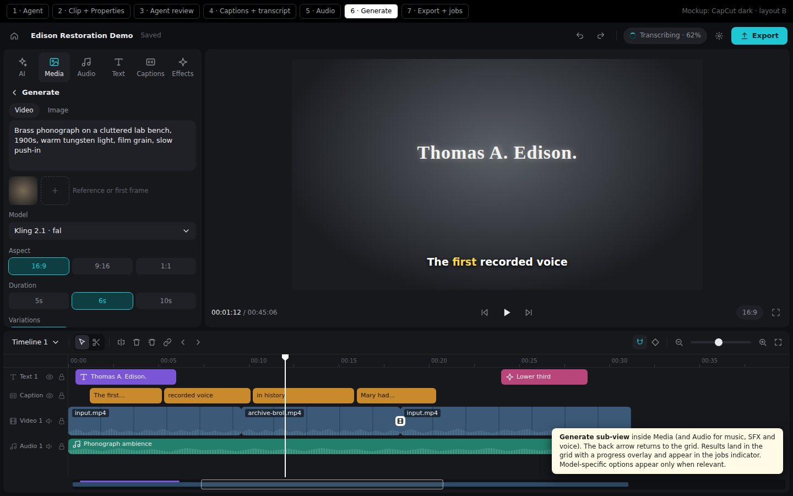
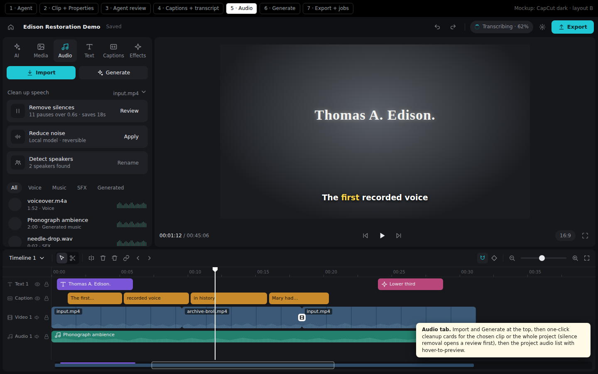
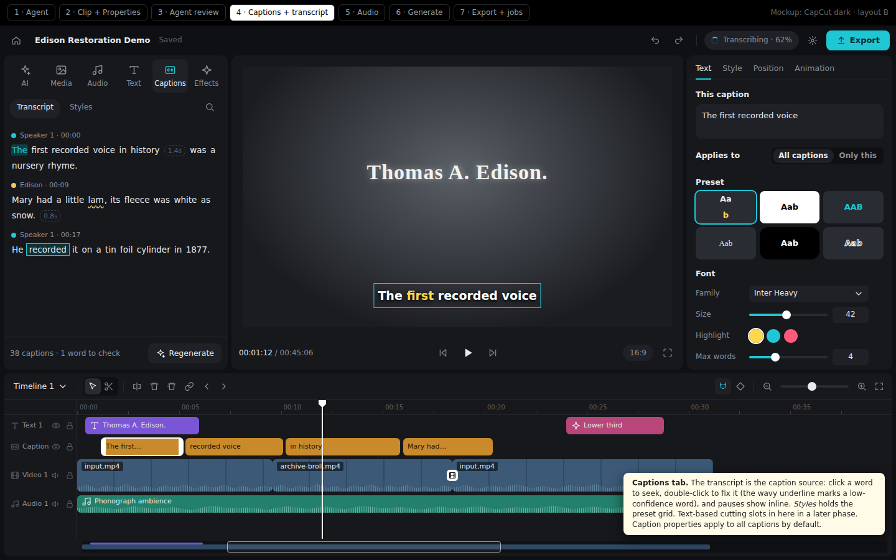
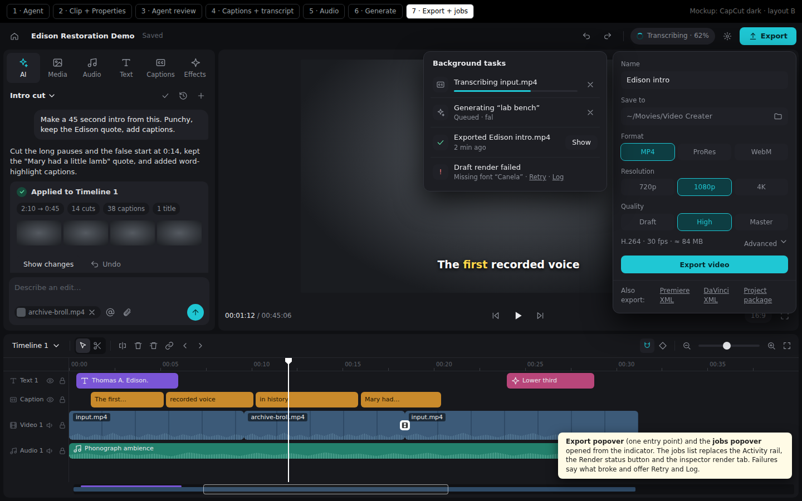

# Editor UI/UX Redesign Design

**Date:** 2026-09-13
**Status:** Approved design, ready for implementation planning
**Mockups:** [assets/2026-09-13-editor-redesign/](assets/2026-09-13-editor-redesign/)
(PNG screenshots plus the HTML sources under `mockups/`)

## Summary

Replace the editor workspace with a simpler, CapCut-style editor built for an
AI-first "director": someone who mostly tells the agent what to make, then
reviews and fine-tunes the result by hand.

The tech stack stays the same (React 19, TypeScript, Tailwind, shadcn/Radix,
lucide, Tauri 2, Rust backend). Two frontend dependencies are added:
`zustand` and the Radix primitive packages behind shadcn components. The
backend contract stays, with three targeted additions:

- the approved VC-001 conversation contract,
- real clip transitions,
- deterministic fixture handlers for browser acceptance flows.

The layout never changes shape:

- asset and AI tabs on the left,
- a large preview in the center,
- contextual properties on the right, shown only when something is selected,
- one full-width timeline at the bottom.

Below 1024 px the same editor switches to a CapCut-mobile layout.

## Problem

The current editor is buggy, unpolished, and hard to understand:

- **Too many surfaces.** A left icon rail with 8 source tabs, a context panel,
  viewer source tabs, a right inspector, a right inspector icon rail, layout
  presets, header dropdown strips, an Activity rail entry, and a "Render status"
  button. It is unclear where anything lives. Render status appears in three
  places and export has two entry points.
- **The agent feels bolted on.** Codex is one tab among many. It exposes
  internal details (layers, safe zone, treatment, `@media-1`) and a hard-coded
  cinematic-trailer prompt.
- **The timeline is noisy.** It has a dense toolbar of unlabeled icons, a heavy
  overview strip, track chrome, timecode clutter, and status badges on clips.
- **The inspector exposes raw data.** Examples are start/end seconds fields,
  transcript word tables, and "Apply 0 changes". These replace meaningful
  controls.
- **The architecture resists change.** `editor-workspace.tsx` is 11,272 lines
  with about 87 `useState` calls. Props are drilled 60–80 deep. Layout is split
  across three state systems. Domain logic is embedded in UI files. Mock and
  dev affordances leak into production.

## Goals

- One stable, learnable layout at desktop sizes and one at phone sizes.
- The agent is a first-class tab with plain-language results, review, and Undo.
- Every capability the product keeps is reachable from an obvious place. No
  capability hides behind implementation vocabulary.
- Properties show meaningful controls for what is selected, never raw storage
  fields.
- The timeline keeps its professional tools but reads calmly.
- Components subscribe to focused stores instead of receiving drilled props.
- Browser Playwright flows prove the core director loop at desktop and phone
  viewports.

## Non-goals

- Redesigning Home or Settings layouts. They only inherit the new global
  tokens, with minimal fixes.
- A light theme.
- A phone runtime (native iOS app or browser pairing). Phone support here means
  the layout works at an iPhone 17 Pro viewport.
- Transcript-based cutting of video (VC-006). The Captions tab reserves space
  for it; a separate spec follows this redesign.
- Stickers, a stock music library, voiceover recording, or slide/push/zoom
  transitions.
- Changing how Rust validates or owns canonical project state.

## Decisions Record

| Topic | Decision |
| --- | --- |
| Scope | Editor workspace only; Home and Settings inherit global tokens |
| Persona | AI-first director |
| CapCut traits | Layout, low chrome, browse-and-drag assets (no main-track magnet) |
| First view | Always the editor, same layout every time |
| Agent placement | First left tab ("AI"); right panel is Properties only |
| Left tabs | AI · Media · Audio · Text · Captions · Effects |
| Backend | Frontend plus targeted backend additions where the UX needs them |
| Tracks | Dynamic, CapCut-style; header shows icon + short name + visibility/mute + lock |
| Advanced timeline | Multiple timelines, overview, keyframe lanes, link/ripple/nudge all stay visible |
| Transitions | Added: crossfade, dip to black, dip to white, wipe (Effects tab) |
| Look | CapCut dark, single cyan accent, 8 px radii, dark-only |
| Top bar | Home + name, Undo/Redo, background-tasks indicator, gear menu, Export |
| No selection | Properties panel collapses; preview grows |
| Agent apply policy | User setting; default auto-applies safe edits; risky work always reviews |
| Generate | In-panel sub-view inside Media and Audio |
| Transcript | Lives in the Captions tab (fix words + styles); cutting is a later phase |
| Audio tab | Project audio, generate music/SFX/voice, speech cleanup tools |
| Text tab | Add text, text style presets, animated titles and lower thirds |
| Effects tab | Effects · Transitions · Backgrounds |
| Export | Popover under the Export button |
| Timing fields | Timeline only (tooltips, right-click "Set duration…") |
| Caption style scope | All captions by default, "Only this caption" toggle |
| Clip AI actions | AI tab in Properties |
| Context menu | Full action set |
| Help and MCP | Gear menu: Project settings, App settings, Keyboard shortcuts, Connect external agents; tour dropped |
| Kept extras | Folders, smart visual search, create matte, organize with agent, chat sessions, variation sets, @mentions, workflow details, nested sequences, dead-air regions, save range as media |
| Dropped | Lottie inputs, speaker recolor, editor tour, layout presets, old narrow/single-pane modes, mock generation buttons, viewer source tabs |
| Build strategy | Hard cut directly on `main`, after extracting domain logic to `lib/` |
| State | Zustand slices |
| Old UI tests | Retired with the old UI; `lib/` tests kept and extended |
| Old editor gates | Retired in the hard-cut commit; remaining gates stay green |
| Sizes | Two layouts: desktop ≥1024 px, mobile <1024 px; laptop 1280×720, iPad, iPhone 17 Pro (402×874) must work |
| Touch insert | Tap `+` on an asset tile inserts at the playhead |
| Tokens | Global |
| VC-001 | Its Rust/bridge contract is implemented inside this redesign |
| Done means | Playwright flows on the fixture transport |
| Plans | One spec plus nine phase plans |

## Information Architecture

```
Editor
├── Top bar ─ Home · Project name/saved · Undo · Redo · Tasks · Gear · Export
├── Left panel (tabs)
│   ├── AI ─ sessions · transcript of conversation · result/review cards · composer
│   ├── Media ─ Import · Generate (sub-view) · filters · folders · smart search · grid
│   ├── Audio ─ Import · Generate (sub-view) · speech cleanup · filters · list
│   ├── Text ─ Add text · text styles · titles & lower thirds
│   ├── Captions ─ Transcript · Styles
│   └── Effects ─ Effects · Transitions · Backgrounds
├── Preview ─ canvas (select/transform/crop) · transport · aspect · fullscreen
├── Properties (selection only) ─ tabs by selection kind
├── Timeline ─ toolbar · track headers · tracks · keyframe lane · overview
└── Overlays ─ Export popover · Tasks popover · Gear menu · Shortcuts sheet ·
               MCP dialog · Context menus · Confirm dialogs · Toasts
```

Visible vocabulary: "AI" (not "Codex"), "Graphics" (not "HyperFrames"),
"Background tasks" (not "Activity" or "Temporal"). Internal IDs such as
`media-1` never render.

## Desktop Layout (≥1024 px)



- **Top bar (48 px):**
  - Home.
  - Editable project name with saved state.
  - Undo and Redo, with ⌘/Ctrl+Z and ⇧⌘/Ctrl+Shift+Z working in the webview.
  - Background tasks indicator, shown only while tasks exist or recently
    finished.
  - Gear menu.
  - The primary **Export** button.
- **Left panel:**
  - Resizable between 300 and 440 px; default 360 px.
  - The tab strip is always visible.
  - Tab content scrolls independently.
- **Preview:**
  - Fills the remaining center space.
  - The transport row shows time, previous frame, play/pause, next frame,
    aspect ratio, and fullscreen.
- **Properties:**
  - Width 330 px.
  - Opens when a selection exists and closes when it is cleared (Esc, or a
    click on empty timeline or preview space).
  - At ≥1280 px it docks as a third column.
  - From 1024 to 1279 px it overlays the right edge of the preview with a
    shadow and never covers the timeline.
- **Timeline:**
  - Full width.
  - The split with the preview row is draggable, default 300 px, clamped so
    the preview keeps at least 240 px.
  - The split position persists per project.

Layout state is one small store slice: left width, split height, and active
left tab. There are no presets and no maximize modes other than preview
fullscreen.

## Mobile Layout (<1024 px)



- **Top bar:**
  - Close (Home) and a truncated project name.
  - Undo and Redo.
  - Compact tasks indicator.
  - Export.
- **Preview:** full width, 16:9 letterbox, with a transport row below.
- **Timeline:**
  - Fills the middle.
  - The playhead is fixed at the horizontal center and content scrolls under
    it.
  - Pinch zooms.
  - Track headers are hidden, and a track's identity is shown by clip color
    and icon.
  - A `+` button at the end of the main track opens Media.
- **Bottom tool bar (78 px):**
  - With nothing selected, it holds the six tabs.
  - With a selection, it switches to clip tools: back, Split, Speed, Volume,
    Animation, Effects, Adjust, Delete, AI. Tools depend on selection kind.
- **Bottom sheets:**
  - Tabs and tools open bottom sheets, which reuse the desktop panel
    components.
  - Sheet heights are 40% for property tools and 70% for AI, Media, and
    generation.
  - Each sheet has a grab handle and a confirm check.
  - Only one sheet is open at a time.
- **Interaction:**
  - Tap `+` on an asset tile inserts at the playhead.
  - Long-press opens the context menu.
  - Drag handles are at least 24 px wide on touch.

The Tauri window minimum size is lowered from 1100×760 to 400×640 so the mobile
layout is reachable in the desktop app. Phone runtime work is out of scope.

## Visual System

Global tokens replace `src/index.css` and map to the Tailwind config. Every
color used by components comes from a token. The implementation must not use
raw hex values or `white/…` opacity classes in components.

| Token | Value | Use |
| --- | --- | --- |
| `--bg` | `#0f1013` | App background, gutters |
| `--panel` | `#17181c` | Panels, timeline, sheets |
| `--raised` | `#202127` | Inputs, cards, active tab |
| `--hover` | `#2a2b32` | Hover, slider track |
| `--line` | `#26282e` | Dividers |
| `--text` | `#e9eaed` | Primary text |
| `--muted` | `#8b8f98` | Secondary text |
| `--dim` | `#5d616a` | Tertiary text, idle icons |
| `--accent` | `#1fc7d4` | Primary actions, active states, focus ring |
| `--accent-soft` | `#0e3d42` | Selected option fills |
| `--destructive` | `#ff6b6b` | Destructive actions, errors |
| `--warning` | `#f5c45b` | Review-needed, low-confidence |
| `--success` | `#5ee0a8` | Applied, completed |
| `--keyframe` | `#ffd84a` | Keyframes, caption highlight default |
| `--clip-video` | `#2f5d8a` | Video and image clips |
| `--clip-text` | `#7a55d6` | Text clips |
| `--clip-caption` | `#c98a2b` | Caption clips |
| `--clip-audio` | `#23806c` | Audio clips |
| `--clip-graphics` | `#b8467a` | Graphics/template clips |

- **Type:** Inter; 13 px base; 12 px secondary; 11 px labels; tabular numerals
  for time.
- **Radii:** 10 px panels, 8 px controls and tiles, 6 px clips and small
  buttons.
- **Panels:** separated by 6 px gutters of `--bg` rather than borders.
- **Icons:** lucide at 16 px (19–21 px in tab bars). Every icon-only control has
  an accessible name and a tooltip.
- **Motion:** 120–180 ms ease-out for panel, sheet, and popover transitions.
  All motion is disabled under `prefers-reduced-motion`.

## Timeline



### Toolbar (one row)

Left group:

- timeline selector dropdown (new, duplicate, rename, delete; nested sequences
  appear here),
- Select/Blade segmented tool,
- Split, Delete, Ripple delete, Link/Unlink, Nudge left, Nudge right.

Right group:

- Snap toggle, Keyframes toggle, zoom out, zoom slider, zoom in, Fit.

Each control has a tooltip with its shortcut. Disabled state explains why in the
tooltip, for example "Select a clip to split".

### Tracks

- **Created on drop.** Tracks are created when an item is dropped above,
  between, or below existing tracks (drop indicator line). Empty tracks are
  removed after the edit that emptied them, in the same undo step. Both use the
  existing `createTrack` and `removeTracks` actions.
- **Kinds.** Track kinds stay as the project model defines them. Visible names
  are "Video N", "Text N", "Captions", "Graphics N", and "Audio N".
- **Header (118 px).** Kind icon, short name, visibility (visual tracks) or
  mute (audio tracks), and lock. Double-click the name to rename. Headers are
  hidden on mobile.
- **Order.** The main video track sits in the middle band. Text, captions, and
  graphics sit above it and audio sits below. Tracks can be reordered by
  dragging headers within their band.

### Clips

- **Fill.** Kind color fill with a label chip. Video shows a filmstrip and a
  waveform strip when it has audio. Audio shows a waveform. Text, caption, and
  graphics show an icon and the text.
- **Labels.** Truncated only when the clip is too short. There are no status
  badges on clips. Generation state shows as a subtle progress fill, and failure
  as a red corner mark with a tooltip.
- **Selection.** White 2 px outline with trim handles. Multi-select uses
  Shift/⌘-click or marquee.
- **Drag.** Shows a ghost, snap guides, and a time tooltip (start · duration).
  An invalid drop shows a red outline at the target with the reason.
- **Dead-air regions.** Shaded hatch over silent ranges on audio-bearing clips
  when speech analysis exists.
- **Transitions.** A small badge centered on the cut. Drag the badge edges to
  change duration. Click it to open transition properties.

### Keyframes

When the Keyframes toggle is on and a single clip is selected, one lane opens
beneath that clip's track. It shows the property chosen in a lane dropdown
(opacity, scale, position, rotation, volume). Diamonds are draggable. Properties
panel ◇ buttons add or remove a keyframe at the playhead.

### Overview

A thin bar (18 px) under the tracks shows clip density with a draggable viewport
window. Clicking jumps the view.

### Context menu (full set)

- **Clipboard:** Cut, Copy, Paste, Paste insert, Duplicate.
- **Delete:** Delete, Ripple delete, Delete gap.
- **Edit:** Split at playhead, Set duration…, Speed… (visual clips),
  Link/Unlink, Decompose nested sequence. Detach audio is included only if a
  backend action exists; otherwise it is a backlog item.
- **Media:** Replace with media…, Reveal in Media, Save range as media.
- **Transitions:** Add transition (on cuts).
- **AI:** Ask AI about this clip, which focuses the AI tab with the selection
  as context.
- **Track:** Lock, Hide/Mute.

### Keyboard

A single keymap registry, `lib/keymap.ts`, drives handlers, tooltips, the
context-menu hints, and the Shortcuts sheet. Existing timeline and preview
shortcuts are preserved:

- tools and splitting: V, C, S / ⌘K,
- in and out points: I, O,
- delete: Del, ⇧Del,
- clipboard: ⌘C, ⌘X, ⌘V, ⇧⌘V, ⌘D,
- navigation: arrows, Home/End, PageUp/PageDown, [ and ],
- playback: Space,
- Esc.

This redesign adds:

- ⌘Z, ⇧⌘Z (undo, redo),
- ⌘E (export),
- ⌘/ (shortcuts sheet),
- ⌘1–6 (left tabs).

## Preview

- **Composition.** Renders through the existing timeline preview compositor and
  canonical frame path.
- **Canvas selection.** Clicking a visual item on the canvas selects it and
  shows a transform box with scale and rotate handles. "Crop" enters crop mode
  from Properties or a double-click. Text items edit inline on double-click.
- **Asset preview.** Clicking a Media or Audio asset shows it in the viewer with
  a "Previewing: name · Back to timeline" chip. Timeline playback returns on
  Back, Esc, or any timeline interaction. This replaces viewer source tabs.
- **Failure.** Preview failure shows an in-canvas message with Retry. Draft
  render controls move to the tasks and export flows.

## Properties

The panel header shows the selection name. Tabs depend on selection kind.
Controls are sliders with numeric fields, segmented options, preset grids, and
toggles. Every animatable control has a ◇ keyframe button. A section-level
reset button restores defaults.

| Selection | Tabs and contents |
| --- | --- |
| Video / image clip | **Video:** transform (scale, position, rotate, opacity), blend mode, crop ("Edit on canvas"), fade in/out, look presets and color grade. **Audio** (if the clip has audio): volume, fade in/out, denoise. **Speed:** constant speed and reverse where supported. **Animation:** in/out/loop presets and keyframes summary. **AI:** variations, replace with generated, upscale, extend; generated details (prompt, model, references, variation set switcher). |
| Audio clip | **Basic:** volume, fades. **Voice:** denoise, remove silences (review), speakers (rename). **AI:** generated details, variations. No Speed tab: the backend supports speed only for visual clips (`update_visual_clip_speed`). Audio speed is a backlog item. |
| Text | **Text:** content, font, size, color, stroke, background. **Style:** preset grid. **Position:** alignment, safe-area snapping. **Animation:** in/out presets. |
| Caption | **Text:** this caption's words. **Style:** preset grid, font, size, highlight color, max words per line. **Position.** **Animation.** "Applies to: All captions / Only this", defaulting to all, for Style, Position, and Animation. |
| Graphics / title template | **Content:** template fields. **Style:** template style overrides. **Animation:** motion. **Effects.** |
| Transition | Type, duration. |
| Multiple | Common properties only (opacity, volume, effects), with a mixed-value indicator. |

Numeric timing fields (start, duration, source in/out) never appear in
Properties. Effects applied to a clip list in the Video tab's "Effects" section
with their parameters and remove buttons.

## Left Tabs

### AI



- **Header:**
  - Session dropdown (switch, rename, delete, restore) and new chat.
  - History.
  - "Auto-apply safe edits" toggle, a persisted user preference that defaults
    to on.
- **Conversation.** Shows only the user's words and assistant replies, with
  one progress row for the current phase.
- **Applied card:**
  - "Applied" status and a one-line summary.
  - Fact chips (duration before → after, cuts, captions, titles).
  - Post-apply preview frames.
  - **Show changes**, which highlights the affected items and ranges on the
    timeline and seeks to the first one, and **Undo**.
- **Needs-review card:**
  - Summary and fact chips (count, provider/model, estimated cost, what gets
    replaced).
  - The planned placements in plain language.
  - **Primary action** (e.g. "Generate & place", "Apply"), **Edit prompts** or
    **Revise**, and **Dismiss**.
- **Failure card.** States what failed, the next step, and Retry when safe.
- **Composer:**
  - Empty by default.
  - `@` opens a mention picker of media and clips by human name.
  - The current timeline or media selection appears as one removable context
    chip.
  - Attach button.
  - Send.
  - Quick-edit suggestions show only in an empty conversation and fill the
    composer without sending.
- **Variation sets.** Shown as a result card with thumbnails and "Use this"
  per variant, plus the swapper in clip AI properties.

**Apply policy.** Rust classifies risk over validated, normalized actions using
the VC-001 fail-closed allowlist:

- **Auto-apply on:** safe edits apply atomically.
- **Auto-apply off:** every edit shows a review card.
- **Always reviewed, regardless of the setting:** generation, network or
  provider work, render, export, full-timeline replacement, deletion of
  pre-existing sources or tracks, and unknown actions.

This design supersedes one VC-001 rule. VC-001 hid selection context entirely.
Here the current selection may appear as a single human-named removable chip in
the composer, because it is user-visible, user-controlled intent. Internal IDs
and adaptive context payloads remain invisible.

### Media



- **Actions.** **Import** (primary) and **Generate**.
- **Toolbar.**
  - Filter chips: All, Video, Images, Generated.
  - Search field with a "Smart search" toggle (visual semantic search when the
    index exists, with index status and rebuild in its menu).
  - Sort menu and folder breadcrumb.
  - An overflow menu with New folder, Create matte, Organize with AI, and
    Rebuild search index.
- **Grid.**
  - Square thumbnails with duration badges.
  - Folders appear as tiles and are drag targets.
  - Hover shows a `+` button that inserts at the playhead; on touch the button
    is always visible.
  - Drag onto the timeline or preview.
  - Generated items in progress show a progress overlay.
  - Failed items show a retry mark.
- **Generate sub-view.** Replaces the grid, with a back arrow. It contains:
  - Video/Image mode.
  - Prompt.
  - Reference or first/last frame slots.
  - Model select.
  - Model-specific options shown only when relevant (aspect, duration,
    resolution, quality, variations).
  - A footer with estimated cost, a network notice, and **Generate**.
- **After submit.** The view returns to the grid, where the pending item shows
  its progress. Direct generation from this composer is an explicit user
  action, so no extra review step is added.
- **Mock completion.** Mock generation completion controls exist only in the
  fixture runtime.

### Audio



- **Actions.** **Import** and **Generate** (music, SFX, voice) using the same
  sub-view pattern.
- **Clean up speech.** A target select (selected clip, or a source for the whole
  project) and cards for:
  - Remove silences (count and time saved; opens a review listing ranges before
    the ripple edit),
  - Reduce noise (local, reversible),
  - Detect speakers (count, rename).
- **List.**
  - Filter chips: All, Voice, Music, SFX, Generated.
  - Rows with play-preview, name, duration and kind, and a mini waveform.
  - `+` to insert at the playhead.

### Text

- **Add text** inserts a default text item at the playhead.
- **Text styles:** a grid of text presets rendered live.
- **Titles & lower thirds:** a grid of motion templates with hover (desktop) or
  tap-preview (mobile) animation. Insert via drag or `+`.

### Captions



- **Empty state.** With no transcript, a **Generate captions** card offers
  source, language, max words per line, and censor profanity. It queues
  transcription if needed.
- **Transcript view.** Speaker-labelled paragraphs with timestamps.
  - The current word is highlighted during playback.
  - Click a word to seek.
  - Double-click to fix a word (`editTranscriptWords` / `applyCaptionRepair`).
  - Low-confidence words show a wavy underline.
  - Pauses show as inline chips.
- **Footer.** Caption count, words to check, and **Regenerate**.
- **Styles view.** A caption preset grid applied to all captions.
- **Layout.** The view layout reserves a selection model (word ranges) so
  VC-006 cutting can add strike and delete later without restructuring.

### Effects

- Filter chips: Effects, Transitions, Backgrounds.
- **Effects:** catalog tiles with previews; drop or `+` on the selected visual
  clip.
- **Transitions:** tiles; drop onto a cut, or `+` with a cut selected (or the
  cut nearest the playhead).
- **Backgrounds:** shader background templates; insert as clips.

## Overlays



### Export popover

- **Fields.** Name, Save to (native picker), Format (MP4 / ProRes / WebM,
  filtered by export capability report), Resolution (720p / 1080p / 4K),
  Quality (Draft / High / Master). A summary line (codec · fps · estimated
  size) and an **Advanced** disclosure (codec H.264/H.265, frame rate).
- **Primary action.** **Export video**.
- **Footer.** "Also export: Premiere XML · DaVinci XML · Project package".
- **Unavailable profiles.** Shown disabled with the reason.
- **On start.** The popover closes, the task appears in Background tasks, and a
  toast offers **Show in folder** on completion.

### Background tasks

- **Indicator.** A pill in the top bar (spinner and the most important task's
  progress), hidden when idle and 10 minutes after the last completion.
- **Popover list.** Covers transcription, analysis, generation, render, export,
  and agent jobs. Each row shows:
  - kind icon, label, and progress bar or status line,
  - Cancel (when cancellable), Show (when an artifact exists), or Retry and
    Log (on failure, with the failure reason in plain words).
- **Details view.** A "Details" row action opens workflow internals: execution
  backend, workflow ID, worker preflight, queue position, and timestamps.
- **Replaces.** The Activity rail, the "Render status" button, and the render
  review inspector tab. The preview-vs-render comparison is available from a
  completed render's Details.

### Gear menu

- Project settings (opens existing Project Settings view)
- App settings (opens existing Settings)
- Keyboard shortcuts (sheet generated from the keymap registry)
- Connect external agents (dialog with MCP setup snippets and copy buttons)
- Project skills (dialog)

### Dialogs, confirmations, toasts

All modals, popovers, menus, sheets, and tooltips use shadcn/Radix primitives.
`window.prompt` and `window.confirm` are not used. Destructive confirmations
name the object and consequence. Toasts are for completion and undoable
background outcomes only. Validation problems appear at the target control or
timeline position.

## State Architecture

Zustand stores, created per open project and provided through one
`EditorStoreProvider`:

| Slice | Owns |
| --- | --- |
| `project` | Canonical project, revision, save status, `applyAction(s)`, history (undo/redo stacks), agent batch undo identities |
| `selection` | Selected item IDs, selected cut, selected track, marquee, affected-range highlights |
| `playback` | Playhead, playing, preview source (timeline or asset), fullscreen |
| `timelineView` | Active timeline ID, zoom, scroll, snap, keyframe toggle, lane property, split height (persisted per project) |
| `ui` | Active left tab, left width, open sheet (mobile), open popover, generate sub-view state, layout mode (derived from width) |
| `jobs` | Background task records, polling, cancellation |
| `agent` | Sessions, messages, progress phase, pending review, auto-apply preference |

Rules:

- Components select narrow state with selectors. Commands live in store actions
  that call `lib/` domain functions and the `backendClient` wrappers in
  `lib/project.ts`.
- Domain logic stays pure in `lib/` and is unit-tested without React.
- All canonical mutations go through `project.applyAction(s)`, which records
  history. Agent applies record a batch undo identity from the Rust result.
- Undo history holds only user-visible edit revisions. Job bookkeeping actions
  (`recordJob`, `updateJobStatus`, `updateJobProviderRequest`,
  `attachRenderReport`, `recordExportArtifact`) and generation status updates
  apply without creating undo steps. Today these land on the undo stack.
- History depth is capped at 100 snapshots per session and is not persisted.
- Agent batch undo uses the existing Rust agent history
  (`record_agent_project_action_batch` / `undo_latest_agent_project_action` in
  `project/split.rs`), exposed as Tauri commands.
- The backend emits no job progress events. The `jobs` slice polls
  `loadSplitProjectFromFolder` while non-terminal jobs exist (1 s, backing off
  to 5 s after 60 s) and merges job and generated-asset state without replacing
  unrelated in-flight edits.
- `localStorage` keys for the old layout, rail, tour, and chat transcript are
  migrated or deleted. New persisted keys use the `video-creater.editor.v2.`
  prefix.

## Module Layout

```
src/editor/
  editor-root.tsx            store provider, layout mode switch
  store/                     zustand slices + selectors + tests
  shell/                     top bar, desktop layout, mobile layout, sheets
  panels/ai/                 AI tab, cards, composer, sessions
  panels/media/              media grid, folders, search, generate sub-view, matte
  panels/audio/              audio list, cleanup cards
  panels/text/               text presets, titles
  panels/captions/           transcript view, styles, generate captions
  panels/effects/            effects, transitions, backgrounds
  preview/                   viewer, canvas interactions, transport
  properties/                properties panel, per-kind tabs, controls
  timeline/                  toolbar, tracks, clips, keyframe lane, overview, menus
  overlays/                  export popover, tasks, gear menu, shortcuts, MCP dialog
src/components/ui/           shadcn primitives (dialog, popover, dropdown-menu,
                             context-menu, tabs, slider, tooltip, toggle-group,
                             scroll-area, sheet, input, select, switch, toast)
src/lib/                     domain logic (extracted + existing)
```

Target: no editor source file over 600 lines.

## Backend Additions

1. **VC-001 conversation contract.** Implement the Rust and bridge portions of
   [the Codex rail proposal workspace design](2026-07-25-codex-rail-proposal-workspace-design.md):
   - preset-free conversation request,
   - hidden adaptive context,
   - validation before classification,
   - fail-closed risk allowlist,
   - atomic batch apply with snapshot undo and conflict detection,
   - apply result (`projectRevision`, `undoIdentity`, `summary`, facts,
     `affectedItemIds`, `affectedRanges`, `previewTimestamp`).

   The auto-apply setting is enforced on the client:
   - Rust always returns the prepared proposal with its risk level.
   - The client calls the apply command without approval only when the level
     is `safe` and "Auto-apply safe edits" is on.
   - Otherwise the client shows the review card.

   The apply command recomputes risk from the current project and refuses
   review-level bundles unless `reviewApproved` is true. A client bug therefore
   cannot auto-apply risky work. The React portions of that plan are superseded
   by this design's AI tab.

   Reuse what already exists:
   - `validate_codex_edit_proposal` and `materialize_codex_edit_proposal_actions`
     in `codex/proposal.rs`,
   - `apply_project_actions_to_split_project` (leased, revision-advancing),
   - the agent history in `project/split.rs` for batch undo.

   Add a TS wrapper for the existing
   `capture_canonical_preview_frame_in_split_project_folder` command, used for
   result-card frames.
2. **Transitions.** Today nothing supports transitions: not GES, XMEML, FCPXML
   or preview. `validate_no_increased_timeline_overlap` rejects any action that
   increases same-track overlap, so transitions must not overlap clips in the
   canonical timeline. Instead:
   - **Model:** a transition is stored on the track as
     `transitions: [{ id, leftItemId, rightItemId, kind, durationSeconds }]`.
     `kind` is `crossfade`, `dipToBlack`, `dipToWhite` or `wipe`. The left and
     right items must be adjacent (the left end equals the right start, within
     one frame).
   - **Timing:** the transition is centered on the cut. It requires
     `durationSeconds / 2` of unused source media after the left item's
     `sourceOut` and before the right item's `sourceIn`. Validation reports the
     maximum available duration when handles are short.
   - **Canonical timeline:** clip start and duration never change, so the
     overlap validator and ripple logic are unaffected. Moving, trimming,
     splitting or deleting either item removes or re-validates its transitions
     in the same action.
   - **Actions:** `addTransition`, `updateTransition` and `removeTransition`,
     mirrored in TS `applyProjectActionLocally`, the Codex action schema and the
     MCP tools. They are on the safe allowlist.
   - **GES render:** the render plan extends both clips into their handles to
     create the overlap only inside the GES timeline. Crossfade uses a GES
     transition clip or auto-transition with `crossfade`. Wipe uses an SMPTE
     transition type. Dips animate both clips' alpha through a solid color
     layer. Audio uses an equal-power crossfade envelope via volume control
     points. The GES backend currently ignores audio fades, so this audio
     envelope work also adds fade support to `apply_audio_clip_properties`.
   - **macOS AVFoundation:** the exporter's `build_request` rejects render plans
     that contain transitions. The existing selection in
     `render_project_media_after_job_started` then falls back to GES.
     Native AVFoundation transitions are a follow-up.
   - **Preview:** `buildTimelinePreviewFrame` produces both layers with
     transition opacity or clip masks during the transition window, and
     canonical sampling matches it.
   - **NLE export:** XMEML `<transitionitem>` and FCPXML `<transition>` for
     crossfade and dips. Wipe is exported as a cut with a limitation note.
3. **Fixture transport handlers.** Deterministic implementations for the
   operations the Playwright flows need. The current handlers throw
   `BackendUnavailableError`. Operations to cover:
   - `load_split_project_from_folder`, `save_split_project_to_folder`,
   - `import_media_to_project`, `prepare_project_preview`,
   - project action application, transcription job lifecycle, conversation
     start/apply/undo,
   - `get_export_profile_availability_report`, export start and progress
     events.

   They live in `src/lib/runtime/fixtures/` and ship only in DEV builds.

## Behavior Details

- **Undo scope.** Every user edit and every agent batch is one undo step. Undo
  of an agent batch uses the Rust snapshot. When a later edit conflicts, the
  card's Undo is disabled with the reason, and global ⌘Z still undoes the
  latest step.
- **Empty project.** The AI tab is active and the timeline shows a drop zone
  ("Drop media here or ask AI to start"). Media shows a large import drop zone.
- **Missing transcription model.** The Captions tab and cleanup cards show
  "Install a transcription model" with a link to Settings → Models. The AI tab
  shows the same message inline only when a request needs it.
- **Offline and provider errors.** Generation and network actions show the
  error inline in the sub-view or card, with the provider name and next step.
- **Accessibility.**
  - Every control is reachable by keyboard.
  - Focus is visible (accent ring).
  - Tabs, menus, and dialogs follow Radix semantics.
  - Status uses text, not color alone.
  - The timeline exposes items as a listbox per track with arrow-key
    navigation and announces time on move.
  - Review cards take focus only when user action is required.

## Engineering Strategy

1. **Foundations (old UI still running).**
   - Extract pure domain logic from `components/workspace/*` into `lib/`
     modules, using characterization tests.
   - Delete dead code.
   - Add the keymap registry.
   - `main` stays green.
2. **Hard cut and shell.** One commit deletes:
   - `components/workspace/` editor files and their tests,
   - old-layout `lib/` modules,
   - editor visual-QA scenarios, baselines, and scripts' editor sections,
   - Palmier comparison tooling tied to the old editor,
   - obsolete package scripts.

   The same commit keeps Home, Settings, and remaining gates green. Backend
   exports that temporarily lose consumers go in one documented `knip` block,
   removed by plan 09.

   Global tokens (with a Home/Settings baseline refresh), `zustand`, and the
   Radix primitives land next, each in the commit that first consumes it. The
   shell follows: stores, top bar, both layouts, empty panels, and a Playwright
   smoke test.
3. **Timeline.**
4. **Preview and Properties.**
5. **Left tabs.** Media, Audio, Text, Captions, Effects (effects and
   backgrounds).
6. **AI tab and VC-001 backend.**
7. **Export popover, tasks, gear menu, shortcuts, MCP dialog, native menu
   rewiring.**
8. **Transitions** (backend, preview, Effects tab, properties, context menu).
9. **Mobile interaction polish, Playwright acceptance flows, docs and backlog
   updates.**

The editor is intentionally non-functional on `main` between phase 2 and the
end of phase 9. Every commit keeps typecheck, lint, unit tests, and the
remaining gates green.

## Acceptance

The redesign is done when Playwright flows pass on the fixture transport at a
desktop viewport (1440×900) and at an iPhone 17 Pro viewport (402×874):

1. **Open and import.** Open the sample project, then import a fixture media
   file from Media. It appears in the grid and inserts at the playhead with `+`.
2. **Ask the agent (auto-apply on).**
   - Submit a prompt that returns a safe edit.
   - The applied card shows facts.
   - Show changes highlights the timeline.
   - Undo restores the prior revision.
3. **Ask the agent (review).** Submit a generation prompt. The review card
   appears, the project is unchanged until **Generate & place**, and Dismiss
   leaves it unchanged.
4. **Auto-apply off.** Toggle the setting off. A safe edit now shows a review
   card first.
5. **Edit a clip.**
   - Select a clip and change opacity in Properties.
   - Add a keyframe.
   - Split at the playhead from the toolbar or tool bar.
   - Undo and Redo with keyboard (desktop) or buttons (mobile).
6. **Captions.** Generate captions (fixture transcription). Fix a word in the
   Transcript. Change the style preset, and it applies to all captions.
7. **Transition.** Add a crossfade on a cut from Effects. Change its duration in
   Properties.
8. **Export.** Open the Export popover and choose MP4 1080p. The task appears in
   Background tasks, completes, and shows Show in folder.

Also required:

- no browser console errors during the flows,
- keyboard-only completion of flow 5 on desktop,
- `pnpm lint`, typecheck, `pnpm test`, `pnpm check:unused`, and remaining gates
  green,
- no editor source file over 600 lines.

## Risks

- **Long broken window on `main`.** Accepted by decision. Mitigation: phases
  ship in order, and the shell's Playwright smoke protects the app boot.
- **Hidden domain logic lost in deletion.** Mitigation: phase 1 extraction with
  tests before the cut. The cut deletes only files whose remaining content is
  presentational.
- **Fixture flows diverge from native behavior.** Mitigation: fixture handlers
  reuse `lib/` pure action application (`applyProjectActionLocally`) and real
  export capability shapes. Native verification remains a follow-up, not the
  acceptance gate for this redesign.
- **VC-001 backend size.** It is the largest backend item. It is isolated in
  phase 6 with its own Rust contract tests.
- **Transitions across preview and render.** Parity must hold for four kinds.
  Mitigation: canonical sampling tests plus the existing preview-render
  comparison tooling on a transition fixture.
